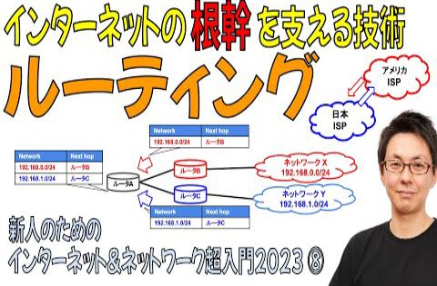
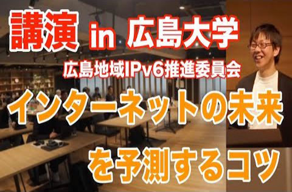
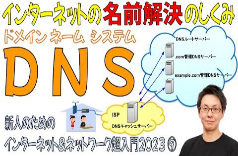

# show int レポート

## 動画名

1. [【超入門2023⑧】「ルーティング」の概念がわかると「インターネットのしくみ」がわかる【6分で解説】](https://www.youtube.com/watch?v=5Mlsgp8ZmRE) ( 2024-03-19 公開)

1. [ネットワーク担当者が知っておくべき「ピアリング交渉」のはじめかた【show int x BIGLOBE】](https://www.youtube.com/watch?v=RSkBvJyJXqo) ( 2024-03-25 公開)

1. [日本国内のISPが海外にネットワーク拠点を持つ理由【本編動画は概要欄から】 #インターネット #BIGLOBE #ISP #ネットワーク #show_int](https://www.youtube.com/watch?v=lbvZyXrDoj4) ( 2024-03-26 公開)

1. [ベテラン ネットワークアーキテクトが語る「美しいネットワーク」とは  #インターネット #BIGLOBE #ISP #ネットワーク #show_int](https://www.youtube.com/watch?v=EpxuLG10L7Y) ( 2024-03-27 公開)

1. [BIGLOBEネットワークチームが掲げる「人材育成の３本柱」とは #BIGLOBE #ISP #ネットワーク #show_int #人材育成](https://www.youtube.com/watch?v=lyWa04KNwP8) ( 2024-03-28 公開)

1. [BIGLOBEがエンジニアとして「採用したい人材」とは #BIGLOBE #ISP #ネットワーク #show_int #採用](https://www.youtube.com/watch?v=88tPjnWtafs) ( 2024-03-29 公開)

1. [【講演】インターネットの未来を予測するコツ【広島地域IPv6推進委員会】](https://www.youtube.com/watch?v=7VQnQI0CaFA) ( 2024-04-01 公開)

1. [「勉強してくれない若手エンジニア」に悩む上司・先輩は何をするべき？【新人教育】](https://www.youtube.com/watch?v=Lk2Dv3nFHmk) ( 2024-04-08 公開)

1. [人生における「重要な選択」を決断するための考え方](https://www.youtube.com/watch?v=XQPIjZFm9us) ( 2024-04-15 公開)

1. [初心者が最初につまづく「ルーター」と「スイッチ」の違いを解説](https://www.youtube.com/watch?v=2qNRO7_5RmQ) ( 2024-04-22 公開)

1. [【超入門2023⑨】DNS 名前解決の仕組みを５分でざっくり解説](https://www.youtube.com/watch?v=G_Vhuktg-YI) ( 2024-04-29 公開)

1. [仕事で忙殺される若手エンジニアのためのキャリア戦略術](https://www.youtube.com/watch?v=oDm-Gj9vU7U) ( 2024-05-06 公開)

1. [クラウドインフラ利用に向いているWebサービス・向いていないWebサービス](https://www.youtube.com/watch?v=sDK6la8Xg80) ( 2024-05-13 公開)

1. [NTTが掲げる次世代構想 IOWN と APN (オールフォトニクス・ネットワーク) をざっくり解説](https://www.youtube.com/watch?v=lt-jFA4rwwU) ( 2024-05-20 公開)

1. [ローカル5G技術を利用した未来のゴルフ中継インターネットライブ配信システム【NEC】【JANOG53プログラム解説】](https://www.youtube.com/watch?v=1Ldlm3nDAAc) ( 2024-05-27 公開)

|||
|---|---|
|動画名|【超入門2023⑧】「ルーティング」の概念がわかると「インターネットのしくみ」がわかる【6分で解説】|
|動画URL|https://www.youtube.com/watch?v=5Mlsgp8ZmRE|
|動画公開日|2024-03-19|
|サムネイル||
|再生回数|1021|
|グッド回数|24|
|バッド回数|0|
|||

|||
|---|---|
|動画名|ネットワーク担当者が知っておくべき「ピアリング交渉」のはじめかた【show int x BIGLOBE】|
|動画URL|https://www.youtube.com/watch?v=RSkBvJyJXqo|
|動画公開日|2024-03-25|
|サムネイル||
|再生回数|791|
|グッド回数|22|
|バッド回数|0|
|||

|||
|---|---|
|動画名|日本国内のISPが海外にネットワーク拠点を持つ理由【本編動画は概要欄から】 #インターネット #BIGLOBE #ISP #ネットワーク #show_int|
|動画URL|https://www.youtube.com/watch?v=lbvZyXrDoj4|
|動画公開日|2024-03-26|
|サムネイル||
|再生回数|578|
|グッド回数|2|
|バッド回数|0|
|||

|||
|---|---|
|動画名|ベテラン ネットワークアーキテクトが語る「美しいネットワーク」とは  #インターネット #BIGLOBE #ISP #ネットワーク #show_int|
|動画URL|https://www.youtube.com/watch?v=EpxuLG10L7Y|
|動画公開日|2024-03-27|
|サムネイル||
|再生回数|407|
|グッド回数|3|
|バッド回数|0|
|||

|||
|---|---|
|動画名|BIGLOBEネットワークチームが掲げる「人材育成の３本柱」とは #BIGLOBE #ISP #ネットワーク #show_int #人材育成|
|動画URL|https://www.youtube.com/watch?v=lyWa04KNwP8|
|動画公開日|2024-03-28|
|サムネイル||
|再生回数|278|
|グッド回数|3|
|バッド回数|0|
|||

|||
|---|---|
|動画名|BIGLOBEがエンジニアとして「採用したい人材」とは #BIGLOBE #ISP #ネットワーク #show_int #採用|
|動画URL|https://www.youtube.com/watch?v=88tPjnWtafs|
|動画公開日|2024-03-29|
|サムネイル||
|再生回数|302|
|グッド回数|6|
|バッド回数|0|
|||

|||
|---|---|
|動画名|【講演】インターネットの未来を予測するコツ【広島地域IPv6推進委員会】|
|動画URL|https://www.youtube.com/watch?v=7VQnQI0CaFA|
|動画公開日|2024-04-01|
|サムネイル||
|再生回数|563|
|グッド回数|16|
|バッド回数|0|
|||

|||
|---|---|
|動画名|「勉強してくれない若手エンジニア」に悩む上司・先輩は何をするべき？【新人教育】|
|動画URL|https://www.youtube.com/watch?v=Lk2Dv3nFHmk|
|動画公開日|2024-04-08|
|サムネイル||
|再生回数|980|
|グッド回数|19|
|バッド回数|0|
|||

|||
|---|---|
|動画名|人生における「重要な選択」を決断するための考え方|
|動画URL|https://www.youtube.com/watch?v=XQPIjZFm9us|
|動画公開日|2024-04-15|
|サムネイル||
|再生回数|495|
|グッド回数|13|
|バッド回数|0|
|||

|||
|---|---|
|動画名|初心者が最初につまづく「ルーター」と「スイッチ」の違いを解説|
|動画URL|https://www.youtube.com/watch?v=2qNRO7_5RmQ|
|動画公開日|2024-04-22|
|サムネイル||
|再生回数|3276|
|グッド回数|89|
|バッド回数|0|
|||

|||
|---|---|
|動画名|【超入門2023⑨】DNS 名前解決の仕組みを５分でざっくり解説|
|動画URL|https://www.youtube.com/watch?v=G_Vhuktg-YI|
|動画公開日|2024-04-29|
|サムネイル||
|再生回数|721|
|グッド回数|15|
|バッド回数|0|
|||

|||
|---|---|
|動画名|仕事で忙殺される若手エンジニアのためのキャリア戦略術|
|動画URL|https://www.youtube.com/watch?v=oDm-Gj9vU7U|
|動画公開日|2024-05-06|
|サムネイル||
|再生回数|857|
|グッド回数|23|
|バッド回数|0|
|||

|||
|---|---|
|動画名|クラウドインフラ利用に向いているWebサービス・向いていないWebサービス|
|動画URL|https://www.youtube.com/watch?v=sDK6la8Xg80|
|動画公開日|2024-05-13|
|サムネイル||
|再生回数|1170|
|グッド回数|38|
|バッド回数|0|
|||

|||
|---|---|
|動画名|NTTが掲げる次世代構想 IOWN と APN (オールフォトニクス・ネットワーク) をざっくり解説|
|動画URL|https://www.youtube.com/watch?v=lt-jFA4rwwU|
|動画公開日|2024-05-20|
|サムネイル||
|再生回数|2637|
|グッド回数|47|
|バッド回数|0|
|||

|||
|---|---|
|動画名|ローカル5G技術を利用した未来のゴルフ中継インターネットライブ配信システム【NEC】【JANOG53プログラム解説】|
|動画URL|https://www.youtube.com/watch?v=1Ldlm3nDAAc|
|動画公開日|2024-05-27|
|サムネイル||
|再生回数|416|
|グッド回数|11|
|バッド回数|0|
|||

