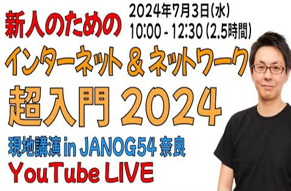

# show int レポート

## 動画名

1. [新しい CDN 配信 のしくみ Open Caching (オープン・キャッシング) をざっくり解説【JANOG53プログラム解説】](https://www.youtube.com/watch?v=KnweWgTBFyg)  
 ( 2024-06-03 公開)

1. [次世代の公衆Wi-Fi 基盤 OpenRoaming（オープン ローミング） についてざっくり解説 【JANOG53プログラム解説】](https://www.youtube.com/watch?v=UvSrWVLRML4)  
 ( 2024-06-10 公開)

1. [JANOG54開催直前！show int の中の人が気になってる注目プログラム【2024年7月3-5日開催予定】](https://www.youtube.com/watch?v=jjEy_2RwBSo)  
 ( 2024-06-17 公開)

1. [最先端技術が生まれる世界の中心地 シリコンバレー に行ってきた](https://www.youtube.com/watch?v=jQrzaRXby_s)  
 ( 2024-06-24 公開)

1. [show int の中の人 ネットワークエンジニアが転職した話](https://www.youtube.com/watch?v=ri7oa6-sLHs)  
 ( 2024-07-01 公開)

1. [【テスト配信】JANOG54講演に向けたテスト配信 &amp; 雑談配信やります](https://www.youtube.com/watch?v=wlfMgU7rUrs)  
 ( 2024-07-02 公開)

1. [【講演】新人のためのインターネット&amp;ネットワーク超入門2024 【JANOG54奈良】【YouTubeLIVE】](https://www.youtube.com/watch?v=UoR9-_Pn-I8)  
 ( 2024-07-03 公開)

1. [JANOG54 in 奈良の終了直後！ 現地の様子を振り返ってみた](https://www.youtube.com/watch?v=TgX16R6LMo8)  
 ( 2024-07-08 公開)

1. [エンジニアとして活躍するには「強みを伸ばすべき？」「弱みを無くすべき？」](https://www.youtube.com/watch?v=knFM1U8V-ug)  
 ( 2024-07-15 公開)

1. [外資企業と日本企業の働き方の違いについて比較してみた](https://www.youtube.com/watch?v=erqpRKLfDG4)  
 ( 2024-07-22 公開)

1. [eSports ゲーマー向けISP を調べてみたら、実は老舗ISPが運営していた話](https://www.youtube.com/watch?v=gWa3zPkok-8)  
 ( 2024-07-29 公開)

1. [ネットワーク業界関係者 3200名が集まった JANOG54 in 奈良 を現地レポート【JANOG54前編】](https://www.youtube.com/watch?v=59pn6YjA9JU)  
 ( 2024-08-05 公開)

|||
|---|---|
|動画名|新しい CDN 配信 のしくみ Open Caching (オープン・キャッシング) をざっくり解説【JANOG53プログラム解説】|
|動画URL|https://www.youtube.com/watch?v=KnweWgTBFyg|
|動画公開日|2024-06-03|
|集計期間|2024-06-03 ~ 2024-10-06 ( 125 日間 ) |
|サムネイル||
|再生回数|738 回|
|グッド回数|30|
|バッド回数|0|
|インプレッション数| 0 回|
|インプレッションからのクリック率| 0 %|
|視聴者の年齢と性別| 男性: 100 %  女性: 0% 13～17 歳 0%        18～24 歳 0%        25～34 歳 50%        35～44 歳 27.2% 44～54 歳 22.8%        55～64 歳 0%        65 歳以上 0% |
|トラフィック流入元|show int 登録者へのおすすめ : 48.9%   show int チャンネルページ : 12.1%   show int 再生リスト : 0.1%   show int 登録者への通知機能 : 1.4%   YouTube関連動画 : 12.4%    YouTube検索 : 4.4%   その他のYouTube機能 : 3.1%    その他 : 5.2%   外部サイトからの流入 : 11.7%|

外部サイトからの流入の内訳
    twitter.com : 44.8%
    Google Search : 19.5%
    facebook.com : 17.2%
    Creator Studio : 2.2%
    Yahoo Search : 2.2%
    YouTube : 2.2%
    Google : 1.1%
    Naver : 1.1%
    bing.com : 1.1%
    com.gworks.oneapp.works : 1.1%

|||
|---|---|
|動画名|次世代の公衆Wi-Fi 基盤 OpenRoaming（オープン ローミング） についてざっくり解説 【JANOG53プログラム解説】|
|動画URL|https://www.youtube.com/watch?v=UvSrWVLRML4|
|動画公開日|2024-06-10|
|集計期間|2024-06-10 ~ 2024-10-06 ( 118 日間 ) |
|サムネイル||
|再生回数|625 回|
|グッド回数|11|
|バッド回数|0|
|インプレッション数| 0 回|
|インプレッションからのクリック率| 0 %|
|視聴者の年齢と性別| 男性: 100 %  女性: 0% 13～17 歳 0%        18～24 歳 0%        25～34 歳 52.2%        35～44 歳 22.8% 44～54 歳 25%        55～64 歳 0%        65 歳以上 0% |
|トラフィック流入元|show int 登録者へのおすすめ : 58.7%   show int チャンネルページ : 10.8%   show int 再生リスト : 0%   show int 登録者への通知機能 : 0.3%   YouTube関連動画 : 4.8%    YouTube検索 : 10.2%   その他のYouTube機能 : 3.3%    その他 : 3.2%   外部サイトからの流入 : 8.4%|

外部サイトからの流入の内訳
    Google Search : 50.9%
    twitter.com : 22.6%
    Creator Studio : 3.7%
    Yahoo Search : 3.7%
    facebook.com : 3.7%
    bing.com : 1.8%
    msn.com : 1.8%

|||
|---|---|
|動画名|JANOG54開催直前！show int の中の人が気になってる注目プログラム【2024年7月3-5日開催予定】|
|動画URL|https://www.youtube.com/watch?v=jjEy_2RwBSo|
|動画公開日|2024-06-17|
|集計期間|2024-06-17 ~ 2024-10-06 ( 111 日間 ) |
|サムネイル||
|再生回数|1147 回|
|グッド回数|7|
|バッド回数|1|
|インプレッション数| 0 回|
|インプレッションからのクリック率| 0 %|
|視聴者の年齢と性別| 男性: 100 %  女性: 0% 13～17 歳 0%        18～24 歳 0%        25～34 歳 26.6%        35～44 歳 33% 44～54 歳 29.6%        55～64 歳 10.8%        65 歳以上 0% |
|トラフィック流入元|show int 登録者へのおすすめ : 26.1%   show int チャンネルページ : 8.8%   show int 再生リスト : 0%   show int 登録者への通知機能 : 0.6%   YouTube関連動画 : 46.9%    YouTube検索 : 5.5%   その他のYouTube機能 : 2.3%    その他 : 3.4%   外部サイトからの流入 : 5.8%|

外部サイトからの流入の内訳
    twitter.com : 47.7%
    Google Search : 13.4%
    facebook.com : 8.9%
    Creator Studio : 7.4%
    office.net : 4.4%
    Google : 2.9%
    bing.com : 2.9%
    jp.co.nttdocomo.carriermail : 2.9%
    com.Slack : 1.4%

|||
|---|---|
|動画名|最先端技術が生まれる世界の中心地 シリコンバレー に行ってきた|
|動画URL|https://www.youtube.com/watch?v=jQrzaRXby_s|
|動画公開日|2024-06-24|
|集計期間|2024-06-24 ~ 2024-10-06 ( 104 日間 ) |
|サムネイル||
|再生回数|673 回|
|グッド回数|20|
|バッド回数|0|
|インプレッション数| 0 回|
|インプレッションからのクリック率| 0 %|
|視聴者の年齢と性別| 男性: 100 %  女性: 0% 13～17 歳 0%        18～24 歳 0%        25～34 歳 47%        35～44 歳 28.8% 44～54 歳 24.2%        55～64 歳 0%        65 歳以上 0% |
|トラフィック流入元|show int 登録者へのおすすめ : 53.3%   show int チャンネルページ : 8.9%   show int 再生リスト : 0.4%   show int 登録者への通知機能 : 0.4%   YouTube関連動画 : 11.4%    YouTube検索 : 1.1%   その他のYouTube機能 : 2.6%    その他 : 4.7%   外部サイトからの流入 : 16.7%|

外部サイトからの流入の内訳
    facebook.com : 56.6%
    Google Search : 16.8%
    twitter.com : 7.9%
    Google : 7%
    Yahoo Search : 2.6%
    Creator Studio : 1.7%
    Gmail : 0.8%
    jword.jp : 0.8%
    m.facebook.com : 0.8%
    yimg.jp : 0.8%

|||
|---|---|
|動画名|show int の中の人 ネットワークエンジニアが転職した話|
|動画URL|https://www.youtube.com/watch?v=ri7oa6-sLHs|
|動画公開日|2024-07-01|
|集計期間|2024-07-01 ~ 2024-10-06 ( 97 日間 ) |
|サムネイル||
|再生回数|1049 回|
|グッド回数|22|
|バッド回数|1|
|インプレッション数| 0 回|
|インプレッションからのクリック率| 0 %|
|視聴者の年齢と性別| 男性: 100 %  女性: 0% 13～17 歳 0%        18～24 歳 13.7%        25～34 歳 54.7%        35～44 歳 23.5% 44～54 歳 8.1%        55～64 歳 0%        65 歳以上 0% |
|トラフィック流入元|show int 登録者へのおすすめ : 67%   show int チャンネルページ : 12.3%   show int 再生リスト : 0.9%   show int 登録者への通知機能 : 0.7%   YouTube関連動画 : 5.5%    YouTube検索 : 2.1%   その他のYouTube機能 : 2.5%    その他 : 3.5%   外部サイトからの流入 : 5%|

外部サイトからの流入の内訳
    twitter.com : 56.6%
    facebook.com : 28.3%
    Google Search : 9.4%
    Creator Studio : 1.8%

|||
|---|---|
|動画名|【テスト配信】JANOG54講演に向けたテスト配信 &amp; 雑談配信やります|
|動画URL|https://www.youtube.com/watch?v=wlfMgU7rUrs|
|動画公開日|2024-07-02|
|集計期間|2024-07-02 ~ 2024-10-06 ( 96 日間 ) |
|サムネイル||
|再生回数|186 回|
|グッド回数|0|
|バッド回数|0|
|インプレッション数| 0 回|
|インプレッションからのクリック率| 0 %|
|視聴者の年齢と性別| 男性: 100 %  女性: 0% 13～17 歳 0%        18～24 歳 0%        25～34 歳 0%        35～44 歳 0% 44～54 歳 0%        55～64 歳 0%        65 歳以上 0% |
|トラフィック流入元|show int 登録者へのおすすめ : 73.6%   show int チャンネルページ : 4.8%   show int 再生リスト : 0.5%   show int 登録者への通知機能 : 4.8%   YouTube関連動画 : 6.4%    YouTube検索 : 4.3%   その他のYouTube機能 : 0.5%    その他 : 1.6%   外部サイトからの流入 : 3.2%|

外部サイトからの流入の内訳
    Google Search : 50%
    Creator Studio : 16.6%

|||
|---|---|
|動画名|【講演】新人のためのインターネット&amp;ネットワーク超入門2024 【JANOG54奈良】【YouTubeLIVE】|
|動画URL|https://www.youtube.com/watch?v=UoR9-_Pn-I8|
|動画公開日|2024-07-03|
|集計期間|2024-07-03 ~ 2024-10-06 ( 95 日間 ) |
|サムネイル||
|再生回数|6882 回|
|グッド回数|216|
|バッド回数|3|
|インプレッション数| 0 回|
|インプレッションからのクリック率| 0 %|
|視聴者の年齢と性別| 男性: 98.8 %  女性: 1.2% 13～17 歳 0%        18～24 歳 10.9%        25～34 歳 42.2%        35～44 歳 32.2% 44～54 歳 13.5%        55～64 歳 1.3%        65 歳以上 0% |
|トラフィック流入元|show int 登録者へのおすすめ : 29.6%   show int チャンネルページ : 5%   show int 再生リスト : 0.8%   show int 登録者への通知機能 : 0.1%   YouTube関連動画 : 3%    YouTube検索 : 6.5%   その他のYouTube機能 : 5.7%    その他 : 16.1%   外部サイトからの流入 : 32.7%|

外部サイトからの流入の内訳
    janog.gr.jp : 53%
    twitter.com : 11.6%
    Google Search : 3.8%
    workplace.com : 2.7%
    fwu.ac.jp : 1.8%
    office.net : 1.8%
    hatena.ne.jp : 0.9%
    starcat.co.jp : 0.7%
    Google : 0.4%
    Yahoo Search : 0.3%

|||
|---|---|
|動画名|JANOG54 in 奈良の終了直後！ 現地の様子を振り返ってみた|
|動画URL|https://www.youtube.com/watch?v=TgX16R6LMo8|
|動画公開日|2024-07-08|
|集計期間|2024-07-08 ~ 2024-10-06 ( 90 日間 ) |
|サムネイル||
|再生回数|606 回|
|グッド回数|18|
|バッド回数|1|
|インプレッション数| 0 回|
|インプレッションからのクリック率| 0 %|
|視聴者の年齢と性別| 男性: 100 %  女性: 0% 13～17 歳 0%        18～24 歳 16%        25～34 歳 30.7%        35～44 歳 32.7% 44～54 歳 20.7%        55～64 歳 0%        65 歳以上 0% |
|トラフィック流入元|show int 登録者へのおすすめ : 50.6%   show int チャンネルページ : 10.5%   show int 再生リスト : 0.6%   show int 登録者への通知機能 : 1.4%   YouTube関連動画 : 7.9%    YouTube検索 : 8.5%   その他のYouTube機能 : 3.1%    その他 : 6.7%   外部サイトからの流入 : 10%|

外部サイトからの流入の内訳
    twitter.com : 34.4%
    facebook.com : 31.1%
    Google Search : 11.4%
    Google : 6.5%
    Creator Studio : 3.2%
    com.Slack : 3.2%
    hatenablog.jp : 3.2%
    janog.gr.jp : 1.6%

|||
|---|---|
|動画名|エンジニアとして活躍するには「強みを伸ばすべき？」「弱みを無くすべき？」|
|動画URL|https://www.youtube.com/watch?v=knFM1U8V-ug|
|動画公開日|2024-07-15|
|集計期間|2024-07-15 ~ 2024-10-06 ( 83 日間 ) |
|サムネイル||
|再生回数|476 回|
|グッド回数|19|
|バッド回数|0|
|インプレッション数| 0 回|
|インプレッションからのクリック率| 0 %|
|視聴者の年齢と性別| 男性: 100 %  女性: 0% 13～17 歳 0%        18～24 歳 0%        25～34 歳 73.9%        35～44 歳 26.1% 44～54 歳 0%        55～64 歳 0%        65 歳以上 0% |
|トラフィック流入元|show int 登録者へのおすすめ : 57.5%   show int チャンネルページ : 12.3%   show int 再生リスト : 2.3%   show int 登録者への通知機能 : 1.6%   YouTube関連動画 : 8.6%    YouTube検索 : 5%   その他のYouTube機能 : 2.7%    その他 : 3.7%   外部サイトからの流入 : 5.8%|

外部サイトからの流入の内訳
    twitter.com : 50%
    facebook.com : 17.8%
    Google Search : 10.7%
    Creator Studio : 7.1%

|||
|---|---|
|動画名|外資企業と日本企業の働き方の違いについて比較してみた|
|動画URL|https://www.youtube.com/watch?v=erqpRKLfDG4|
|動画公開日|2024-07-22|
|集計期間|2024-07-22 ~ 2024-10-06 ( 76 日間 ) |
|サムネイル||
|再生回数|901 回|
|グッド回数|19|
|バッド回数|2|
|インプレッション数| 0 回|
|インプレッションからのクリック率| 0 %|
|視聴者の年齢と性別| 男性: 96.6 %  女性: 3.4% 13～17 歳 0%        18～24 歳 0%        25～34 歳 65.2%        35～44 歳 34.8% 44～54 歳 0%        55～64 歳 0%        65 歳以上 0% |
|トラフィック流入元|show int 登録者へのおすすめ : 71.8%   show int チャンネルページ : 7.3%   show int 再生リスト : 0.7%   show int 登録者への通知機能 : 0.8%   YouTube関連動画 : 4.8%    YouTube検索 : 0.7%   その他のYouTube機能 : 1.9%    その他 : 3.2%   外部サイトからの流入 : 8.3%|

外部サイトからの流入の内訳
    twitter.com : 42.6%
    facebook.com : 36%
    Google : 8%
    Google Search : 2.6%
    Creator Studio : 1.3%

|||
|---|---|
|動画名|eSports ゲーマー向けISP を調べてみたら、実は老舗ISPが運営していた話|
|動画URL|https://www.youtube.com/watch?v=gWa3zPkok-8|
|動画公開日|2024-07-29|
|集計期間|2024-07-29 ~ 2024-10-06 ( 69 日間 ) |
|サムネイル||
|再生回数|537 回|
|グッド回数|24|
|バッド回数|0|
|インプレッション数| 0 回|
|インプレッションからのクリック率| 0 %|
|視聴者の年齢と性別| 男性: 100 %  女性: 0% 13～17 歳 0%        18～24 歳 0%        25～34 歳 54.3%        35～44 歳 29.1% 44～54 歳 16.5%        55～64 歳 0%        65 歳以上 0% |
|トラフィック流入元|show int 登録者へのおすすめ : 53.6%   show int チャンネルページ : 12.2%   show int 再生リスト : 0.5%   show int 登録者への通知機能 : 2%   YouTube関連動画 : 6.7%    YouTube検索 : 1.8%   その他のYouTube機能 : 3.7%    その他 : 11.7%   外部サイトからの流入 : 7.4%|

外部サイトからの流入の内訳
    twitter.com : 47.5%
    facebook.com : 22.5%
    Google Search : 7.5%
    com.Slack : 7.5%
    Discord : 2.5%
    Gmail : 2.5%

|||
|---|---|
|動画名|ネットワーク業界関係者 3200名が集まった JANOG54 in 奈良 を現地レポート【JANOG54前編】|
|動画URL|https://www.youtube.com/watch?v=59pn6YjA9JU|
|動画公開日|2024-08-05|
|集計期間|2024-08-05 ~ 2024-10-06 ( 62 日間 ) |
|サムネイル||
|再生回数|804 回|
|グッド回数|12|
|バッド回数|0|
|インプレッション数| 0 回|
|インプレッションからのクリック率| 0 %|
|視聴者の年齢と性別| 男性: 100 %  女性: 0% 13～17 歳 0%        18～24 歳 12.5%        25～34 歳 52.3%        35～44 歳 35.2% 44～54 歳 0%        55～64 歳 0%        65 歳以上 0% |
|トラフィック流入元|show int 登録者へのおすすめ : 54.3%   show int チャンネルページ : 12.6%   show int 再生リスト : 0.3%   show int 登録者への通知機能 : 1.1%   YouTube関連動画 : 7%    YouTube検索 : 2.9%   その他のYouTube機能 : 3.4%    その他 : 8.4%   外部サイトからの流入 : 9.4%|

外部サイトからの流入の内訳
    twitter.com : 60.5%
    facebook.com : 18.4%
    hatenablog.jp : 5.2%
    Google Search : 2.6%
    streamline-wf-hi.appspot.com : 2.6%
    Creator Studio : 1.3%
    feedly.com : 1.3%

