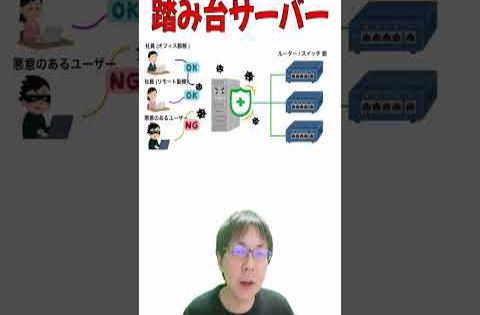

# show int レポート

## 動画名

1. [外資よりも国内企業が圧倒的に優れているポイント３選 【国内企業vs外資企業 比較】](https://www.youtube.com/watch?v=JXg_iQE7xe0)  
 ( 2024-10-21 公開)

1. [JPNIC主催のセミナーイベント Internet Week 2024 開催直前！見どころ解説【11月19〜27日】【show int x JPNIC コラボ】](https://www.youtube.com/watch?v=T-6KBuF_ssg)  
 ( 2024-10-28 公開)

1. [shwo int 2024年度前半の活動を応援企業と振り返ってみた](https://www.youtube.com/watch?v=dIREwHlIFyA)  
 ( 2024-11-04 公開)

1. [エンジニアとしてお給料をたくさん稼いでも幸福度アップに繋がらなかった話](https://www.youtube.com/watch?v=U5Aclp1N-i8)  
 ( 2024-11-11 公開)

1. [「エンジニアも一度はマネージャーを経験した方が良い」という世間のアドバイスに対して真面目に議論してみた](https://www.youtube.com/watch?v=zSU-VMfZtWI)  
 ( 2024-11-18 公開)

1. [たった１つのコンフィグで全メーカーのネットワーク機器に利用できる OpenConfig の活用事例【JANOG54プログラム紹介】](https://www.youtube.com/watch?v=as9O-zhvU4s)  
 ( 2024-11-25 公開)

1. [関西のネットワーク運用者コミュニティ NaniwaNOG 2 in 姫路 に参加してきた](https://www.youtube.com/watch?v=IK5NA-UHGW8)  
 ( 2024-12-02 公開)

1. [【講演】ネットワーク業界に飛び込んだ若手エンジニア&amp;学生の本音を聞いてみた【NaniwaNOG2】](https://www.youtube.com/watch?v=eQBW5bq1jgk)  
 ( 2024-12-09 公開)

1. [ネットワーク機器を支える心臓部 ネットワークチップ（汎用シリコン/ASIC）の世界【ネットワークエンジニアの基本知識】](https://www.youtube.com/watch?v=Xr31WBxfLis)  
 ( 2024-12-16 公開)

1. [ネットワーク運用エンジニアの 良い点・悪い点 を 業界10年超の現役エンジニアがまとめてみた](https://www.youtube.com/watch?v=zvvUixh33Ic)  
 ( 2024-12-23 公開)

1. [1分間で解説「コンソールサーバー」 #ネットワーク機器 #データーセンター #コンソールサーバー](https://www.youtube.com/watch?v=nKbaxU2ZI7Q)  
 ( 2024-12-25 公開)

1. [1分間で解説「踏み台サーバー」 #ネットワーク機器 #データーセンター #show_int #セキュリティ](https://www.youtube.com/watch?v=XDXJIHHXqU4)  
 ( 2024-12-26 公開)

1. [ネットワーク系セールスエンジニアの 良い点・悪い点 を 業界10年超の現役エンジニアがまとめてみた](https://www.youtube.com/watch?v=NotrMF2s8Ls)  
 ( 2024-12-30 公開)

|||
|---|---|
|動画名|外資よりも国内企業が圧倒的に優れているポイント３選 【国内企業vs外資企業 比較】|
|動画URL|https://www.youtube.com/watch?v=JXg_iQE7xe0|
|動画公開日|2024-10-21|
|集計期間|2024-10-21 ~ 2025-02-07 ( 109 日間 ) |
|サムネイル||
|再生回数|517 回|
|グッド回数|16|
|バッド回数|1|
|インプレッション数| 0 回|
|インプレッションからのクリック率| 0 %|
|視聴者の年齢と性別| 男性: 100 %  女性: 0% 13～17 歳 0%        18～24 歳 0%        25～34 歳 69.5%        35～44 歳 30.5% 44～54 歳 0%        55～64 歳 0%        65 歳以上 0% |
|トラフィック流入元|show int 登録者へのおすすめ : 51.4%   show int チャンネルページ : 17.2% YouTube関連動画 : 4.2%    YouTube検索 : 3%   外部サイトからの流入 : 11.9%|

外部サイトからの流入の内訳
    facebook.com : 35.4%
    twitter.com : 29%
    Creator Studio : 3.2%
    Google Search : 3.2%

|||
|---|---|
|動画名|JPNIC主催のセミナーイベント Internet Week 2024 開催直前！見どころ解説【11月19〜27日】【show int x JPNIC コラボ】|
|動画URL|https://www.youtube.com/watch?v=T-6KBuF_ssg|
|動画公開日|2024-10-28|
|集計期間|2024-10-28 ~ 2025-02-07 ( 102 日間 ) |
|サムネイル||
|再生回数|617 回|
|グッド回数|15|
|バッド回数|0|
|インプレッション数| 0 回|
|インプレッションからのクリック率| 0 %|
|視聴者の年齢と性別| 男性: 100 %  女性: 0% 13～17 歳 0%        18～24 歳 0%        25～34 歳 62.7%        35～44 歳 37.3% 44～54 歳 0%        55～64 歳 0%        65 歳以上 0% |
|トラフィック流入元|show int 登録者へのおすすめ : 53.8%   show int チャンネルページ : 11% YouTube関連動画 : 6.1%    YouTube検索 : 3.2%   外部サイトからの流入 : 12.1%|

外部サイトからの流入の内訳
    twitter.com : 30.6%
    facebook.com : 14.6%
    nic.ad.jp : 14.6%
    Gmail : 8%
    internetweek.jp : 8%
    Google Search : 6.6%
    Creator Studio : 2.6%
    bing.com : 2.6%
    YouTube : 1.3%
    kamuitracker.com : 1.3%

|||
|---|---|
|動画名|shwo int 2024年度前半の活動を応援企業と振り返ってみた|
|動画URL|https://www.youtube.com/watch?v=dIREwHlIFyA|
|動画公開日|2024-11-04|
|集計期間|2024-11-04 ~ 2025-02-07 ( 95 日間 ) |
|サムネイル||
|再生回数|249 回|
|グッド回数|7|
|バッド回数|0|
|インプレッション数| 0 回|
|インプレッションからのクリック率| 0 %|
|視聴者の年齢と性別| 男性: 100 %  女性: 0% 13～17 歳 0%        18～24 歳 0%        25～34 歳 51.1%        35～44 歳 48.9% 44～54 歳 0%        55～64 歳 0%        65 歳以上 0% |
|トラフィック流入元|show int 登録者へのおすすめ : 63.8%   show int チャンネルページ : 10% YouTube関連動画 : 3.2%    YouTube検索 : 2.8%   外部サイトからの流入 : 7.6%|

外部サイトからの流入の内訳
    twitter.com : 63.1%
    facebook.com : 36.8%

|||
|---|---|
|動画名|エンジニアとしてお給料をたくさん稼いでも幸福度アップに繋がらなかった話|
|動画URL|https://www.youtube.com/watch?v=U5Aclp1N-i8|
|動画公開日|2024-11-11|
|集計期間|2024-11-11 ~ 2025-02-07 ( 88 日間 ) |
|サムネイル||
|再生回数|1138 回|
|グッド回数|38|
|バッド回数|3|
|インプレッション数| 0 回|
|インプレッションからのクリック率| 0 %|
|視聴者の年齢と性別| 男性: 100 %  女性: 0% 13～17 歳 0%        18～24 歳 17.2%        25～34 歳 64.6%        35～44 歳 18.2% 44～54 歳 0%        55～64 歳 0%        65 歳以上 0% |
|トラフィック流入元|show int 登録者へのおすすめ : 68.4%   show int チャンネルページ : 6.5% YouTube関連動画 : 4.6%    YouTube検索 : 3.1%   外部サイトからの流入 : 5.9%|

外部サイトからの流入の内訳
    twitter.com : 57.3%
    facebook.com : 26.4%
    github.com : 5.8%
    Google Search : 2.9%
    Creator Studio : 1.4%
    discord.com : 1.4%

|||
|---|---|
|動画名|「エンジニアも一度はマネージャーを経験した方が良い」という世間のアドバイスに対して真面目に議論してみた|
|動画URL|https://www.youtube.com/watch?v=zSU-VMfZtWI|
|動画公開日|2024-11-18|
|集計期間|2024-11-18 ~ 2025-02-07 ( 81 日間 ) |
|サムネイル||
|再生回数|983 回|
|グッド回数|30|
|バッド回数|1|
|インプレッション数| 0 回|
|インプレッションからのクリック率| 0 %|
|視聴者の年齢と性別| 男性: 100 %  女性: 0% 13～17 歳 0%        18～24 歳 8.6%        25～34 歳 61.8%        35～44 歳 29.6% 44～54 歳 0%        55～64 歳 0%        65 歳以上 0% |
|トラフィック流入元|show int 登録者へのおすすめ : 70.8%   show int チャンネルページ : 7% YouTube関連動画 : 7.8%    YouTube検索 : 1.9%   外部サイトからの流入 : 2.9%|

外部サイトからの流入の内訳
    twitter.com : 51.7%
    facebook.com : 27.5%
    Creator Studio : 10.3%
    Google Search : 10.3%

|||
|---|---|
|動画名|たった１つのコンフィグで全メーカーのネットワーク機器に利用できる OpenConfig の活用事例【JANOG54プログラム紹介】|
|動画URL|https://www.youtube.com/watch?v=as9O-zhvU4s|
|動画公開日|2024-11-25|
|集計期間|2024-11-25 ~ 2025-02-07 ( 74 日間 ) |
|サムネイル||
|再生回数|976 回|
|グッド回数|37|
|バッド回数|0|
|インプレッション数| 0 回|
|インプレッションからのクリック率| 0 %|
|視聴者の年齢と性別| 男性: 100 %  女性: 0% 13～17 歳 0%        18～24 歳 0%        25～34 歳 50.2%        35～44 歳 29.5% 44～54 歳 20.3%        55～64 歳 0%        65 歳以上 0% |
|トラフィック流入元|show int 登録者へのおすすめ : 60.8%   show int チャンネルページ : 7.3% YouTube関連動画 : 9.6%    YouTube検索 : 4.5%   外部サイトからの流入 : 7.6%|

外部サイトからの流入の内訳
    twitter.com : 64%
    facebook.com : 12%
    Google Search : 6.6%
    office.net : 6.6%
    Naver : 1.3%
    bing.com : 1.3%

|||
|---|---|
|動画名|関西のネットワーク運用者コミュニティ NaniwaNOG 2 in 姫路 に参加してきた|
|動画URL|https://www.youtube.com/watch?v=IK5NA-UHGW8|
|動画公開日|2024-12-02|
|集計期間|2024-12-02 ~ 2025-02-07 ( 67 日間 ) |
|サムネイル||
|再生回数|424 回|
|グッド回数|11|
|バッド回数|0|
|インプレッション数| 0 回|
|インプレッションからのクリック率| 0 %|
|視聴者の年齢と性別| 男性: 100 %  女性: 0% 13～17 歳 0%        18～24 歳 0%        25～34 歳 55.6%        35～44 歳 44.4% 44～54 歳 0%        55～64 歳 0%        65 歳以上 0% |
|トラフィック流入元|show int 登録者へのおすすめ : 52.1%   show int チャンネルページ : 10.3% YouTube関連動画 : 5.1%    YouTube検索 : 4%   外部サイトからの流入 : 20.2%|

外部サイトからの流入の内訳
    facebook.com : 73.2%
    twitter.com : 12.7%
    Google Search : 4.6%

|||
|---|---|
|動画名|【講演】ネットワーク業界に飛び込んだ若手エンジニア&amp;学生の本音を聞いてみた【NaniwaNOG2】|
|動画URL|https://www.youtube.com/watch?v=eQBW5bq1jgk|
|動画公開日|2024-12-09|
|集計期間|2024-12-09 ~ 2025-02-07 ( 60 日間 ) |
|サムネイル||
|再生回数|895 回|
|グッド回数|19|
|バッド回数|0|
|インプレッション数| 0 回|
|インプレッションからのクリック率| 0 %|
|視聴者の年齢と性別| 男性: 100 %  女性: 0% 13～17 歳 0%        18～24 歳 15.4%        25～34 歳 55.3%        35～44 歳 19.7% 44～54 歳 9.6%        55～64 歳 0%        65 歳以上 0% |
|トラフィック流入元|show int 登録者へのおすすめ : 61.3%   show int チャンネルページ : 10.6% YouTube関連動画 : 5%    YouTube検索 : 3.4%   外部サイトからの流入 : 9.7%|

外部サイトからの流入の内訳
    twitter.com : 60.9%
    facebook.com : 16%
    Google Search : 3.4%
    office.net : 3.4%
    com.Slack : 2.2%
    Google : 1.1%
    Naver : 1.1%

|||
|---|---|
|動画名|ネットワーク機器を支える心臓部 ネットワークチップ（汎用シリコン/ASIC）の世界【ネットワークエンジニアの基本知識】|
|動画URL|https://www.youtube.com/watch?v=Xr31WBxfLis|
|動画公開日|2024-12-16|
|集計期間|2024-12-16 ~ 2025-02-07 ( 53 日間 ) |
|サムネイル||
|再生回数|1767 回|
|グッド回数|75|
|バッド回数|0|
|インプレッション数| 0 回|
|インプレッションからのクリック率| 0 %|
|視聴者の年齢と性別| 男性: 100 %  女性: 0% 13～17 歳 0%        18～24 歳 7.3%        25～34 歳 38.8%        35～44 歳 35.5% 44～54 歳 18.4%        55～64 歳 0%        65 歳以上 0% |
|トラフィック流入元|show int 登録者へのおすすめ : 49.1%   show int チャンネルページ : 6.1% YouTube関連動画 : 12.1%    YouTube検索 : 2.6%   外部サイトからの流入 : 14.6%|

外部サイトからの流入の内訳
    twitter.com : 70.5%
    facebook.com : 8.1%
    office.net : 5.4%
    Google Search : 5%
    Chrome : 0.7%
    Google : 0.7%
    YouTube : 0.7%
    com.microsoft.emmx : 0.7%
    simplenote.com : 0.7%
    wowtalkapi.com : 0.7%

|||
|---|---|
|動画名|ネットワーク運用エンジニアの 良い点・悪い点 を 業界10年超の現役エンジニアがまとめてみた|
|動画URL|https://www.youtube.com/watch?v=zvvUixh33Ic|
|動画公開日|2024-12-23|
|集計期間|2024-12-23 ~ 2025-02-07 ( 46 日間 ) |
|サムネイル||
|再生回数|651 回|
|グッド回数|28|
|バッド回数|0|
|インプレッション数| 0 回|
|インプレッションからのクリック率| 0 %|
|視聴者の年齢と性別| 男性: 100 %  女性: 0% 13～17 歳 0%        18～24 歳 0%        25～34 歳 55.9%        35～44 歳 32.8% 44～54 歳 11.3%        55～64 歳 0%        65 歳以上 0% |
|トラフィック流入元|show int 登録者へのおすすめ : 60%   show int チャンネルページ : 8.4% YouTube関連動画 : 12.9%    YouTube検索 : 2.3%   外部サイトからの流入 : 6.2%|

外部サイトからの流入の内訳
    twitter.com : 43.9%
    facebook.com : 31.7%
    bing.com : 12.1%
    Google Search : 4.8%
    Chrome : 2.4%
    com.miui.android.fashiongallery : 2.4%

|||
|---|---|
|動画名|1分間で解説「コンソールサーバー」 #ネットワーク機器 #データーセンター #コンソールサーバー|
|動画URL|https://www.youtube.com/watch?v=nKbaxU2ZI7Q|
|動画公開日|2024-12-25|
|集計期間|2024-12-25 ~ 2025-02-07 ( 44 日間 ) |
|サムネイル||
|再生回数|617 回|
|グッド回数|17|
|バッド回数|0|
|インプレッション数| 0 回|
|インプレッションからのクリック率| 0 %|
|視聴者の年齢と性別| 男性: 100 %  女性: 0% 13～17 歳 0%        18～24 歳 10.6%        25～34 歳 43.1%        35～44 歳 19% 44～54 歳 27.3%        55～64 歳 0%        65 歳以上 0% |
|トラフィック流入元|show int 登録者へのおすすめ : 17%   show int チャンネルページ : 1.7% YouTube関連動画 : 0%    YouTube検索 : 5%   外部サイトからの流入 : 3%|

外部サイトからの流入の内訳
    twitter.com : 31.5%
    Creator Studio : 26.3%
    Google Search : 21%
    office.net : 15.7%

|||
|---|---|
|動画名|1分間で解説「踏み台サーバー」 #ネットワーク機器 #データーセンター #show_int #セキュリティ|
|動画URL|https://www.youtube.com/watch?v=XDXJIHHXqU4|
|動画公開日|2024-12-26|
|集計期間|2024-12-26 ~ 2025-02-07 ( 43 日間 ) |
|サムネイル||
|再生回数|604 回|
|グッド回数|16|
|バッド回数|0|
|インプレッション数| 0 回|
|インプレッションからのクリック率| 0 %|
|視聴者の年齢と性別| 男性: 100 %  女性: 0% 13～17 歳 0%        18～24 歳 12.2%        25～34 歳 41.4%        35～44 歳 26.2% 44～54 歳 20.3%        55～64 歳 0%        65 歳以上 0% |
|トラフィック流入元|show int 登録者へのおすすめ : 16.7%   show int チャンネルページ : 1.9% YouTube関連動画 : 0%    YouTube検索 : 7.6%   外部サイトからの流入 : 1.4%|

外部サイトからの流入の内訳
    Creator Studio : 33.3%
    twitter.com : 22.2%
    kamuitracker.com : 11.1%
    office.net : 11.1%

|||
|---|---|
|動画名|ネットワーク系セールスエンジニアの 良い点・悪い点 を 業界10年超の現役エンジニアがまとめてみた|
|動画URL|https://www.youtube.com/watch?v=NotrMF2s8Ls|
|動画公開日|2024-12-30|
|集計期間|2024-12-30 ~ 2025-02-07 ( 39 日間 ) |
|サムネイル||
|再生回数|416 回|
|グッド回数|13|
|バッド回数|0|
|インプレッション数| 0 回|
|インプレッションからのクリック率| 0 %|
|視聴者の年齢と性別| 男性: 100 %  女性: 0% 13～17 歳 0%        18～24 歳 0%        25～34 歳 59.3%        35～44 歳 40.7% 44～54 歳 0%        55～64 歳 0%        65 歳以上 0% |
|トラフィック流入元|show int 登録者へのおすすめ : 56.9%   show int チャンネルページ : 8.4% YouTube関連動画 : 12.9%    YouTube検索 : 3.1%   外部サイトからの流入 : 7.4%|

外部サイトからの流入の内訳
    twitter.com : 54.8%
    facebook.com : 25.8%
    Google Search : 6.4%

