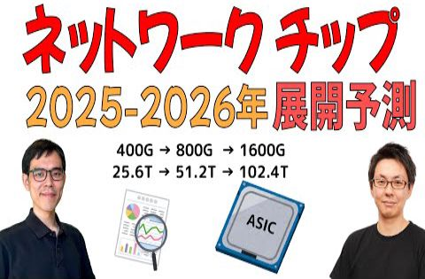
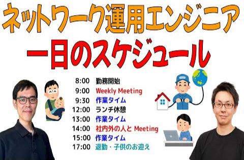

# show int レポート

## 動画名

1. [開催直前！JANOG55 in 京都！ 注目プログラム紹介 【2025年1月22日(水)〜25日(金)】](https://www.youtube.com/watch?v=aHPVahiKu_E)  
 ( 2025-01-06 公開)

1. [時刻同期技術の最前線 IEEE ISPCS2024 参加レポート 【show int x セイコーソリューションズ コラボ企画】](https://www.youtube.com/watch?v=JqYM5B6xqac)  
 ( 2025-01-13 公開)

1. [ネットワーク業界で働くセールスエンジニアの一日のスケジュール](https://www.youtube.com/watch?v=iAifWMt9agQ)  
 ( 2025-01-20 公開)

1. [JANOG55 in 京都 終了直後！ 現地の様子を振り返ってみた](https://www.youtube.com/watch?v=rc5uUq7gtwU)  
 ( 2025-01-27 公開)

1. [ネットワークチップ進化の展開予測 2025年~2026年【インターフェースの高速化・大容量化】](https://www.youtube.com/watch?v=T8W4juInmts)  
 ( 2025-02-03 公開)

1. [ネットワークインテグレーターのエンジニアの働き方【show int x レンジャーシステムズ】](https://www.youtube.com/watch?v=BSFEFQkzPKQ)  
 ( 2025-02-10 公開)

1. [現場のネットワークエンジニアが愛用する仮想ネットワーク検証ツール Containerlab を解説](https://www.youtube.com/watch?v=jXwMHSTqFJw)  
 ( 2025-02-17 公開)

1. [現役ネットワーク運用エンジニアの1日のスケジュールを大公開](https://www.youtube.com/watch?v=yNPXhy-Psg0)  
 ( 2025-02-24 公開)

1. [ネットワークエンジニアが外資企業に転職して気づいた日本企業との違い４選](https://www.youtube.com/watch?v=VU6p1KBxvro)  
 ( 2025-03-03 公開)

1. [外資企業を経験したエンジニアが考える アメリカ企業・日本企業の企業文化の違い](https://www.youtube.com/watch?v=m48C_XtU1_E)  
 ( 2025-03-10 公開)

1. [現役エンジニアのフルリモート勤務の悩みを打ち明けてみた](https://www.youtube.com/watch?v=un6-rJycTE0)  
 ( 2025-03-17 公開)

1. [ネットワーク業界関係者4000人が集まったJANOG55 in 京都 現地レポート【JANOG55前編】](https://www.youtube.com/watch?v=F7JKRaKk4oY)  
 ( 2025-03-24 公開)

|||
|---|---|
|動画名|開催直前！JANOG55 in 京都！ 注目プログラム紹介 【2025年1月22日(水)〜25日(金)】|
|動画URL|https://www.youtube.com/watch?v=aHPVahiKu_E|
|動画公開日|2025-01-06|
|集計期間|2025-01-06 ~ 2025-05-16 ( 130 日間 ) |
|サムネイル||
|再生回数|626 回|
|グッド回数|12|
|バッド回数|0|
|インプレッション数| 0 回|
|インプレッションからのクリック率| 0 %|
|視聴者の年齢と性別| 男性: 100 %  女性: 0% 13～17 歳 0%        18～24 歳 0%        25～34 歳 42%        35～44 歳 58% 44～54 歳 0%        55～64 歳 0%        65 歳以上 0% |
|トラフィック流入元|show int 登録者へのおすすめ : 47.4%   show int チャンネルページ : 13.4% YouTube関連動画 : 5.4%    YouTube検索 : 8.9%   外部サイトからの流入 : 13.5%|

外部サイトからの流入の内訳
    facebook.com : 29.4%
    Google Search : 20%
    twitter.com : 18.8%
    Yahoo Search : 4.7%
    office.net : 4.7%
    bing.com : 2.3%
    YouTube : 1.1%
    com.Slack : 1.1%
    duckduckgo.com : 1.1%

|||
|---|---|
|動画名|時刻同期技術の最前線 IEEE ISPCS2024 参加レポート 【show int x セイコーソリューションズ コラボ企画】|
|動画URL|https://www.youtube.com/watch?v=JqYM5B6xqac|
|動画公開日|2025-01-13|
|集計期間|2025-01-13 ~ 2025-05-16 ( 123 日間 ) |
|サムネイル||
|再生回数|360 回|
|グッド回数|10|
|バッド回数|0|
|インプレッション数| 0 回|
|インプレッションからのクリック率| 0 %|
|視聴者の年齢と性別| 男性: 100 %  女性: 0% 13～17 歳 0%        18～24 歳 0%        25～34 歳 48.9%        35～44 歳 51.1% 44～54 歳 0%        55～64 歳 0%        65 歳以上 0% |
|トラフィック流入元|show int 登録者へのおすすめ : 49.7%   show int チャンネルページ : 9.1% YouTube関連動画 : 14.1%    YouTube検索 : 8%   外部サイトからの流入 : 7.5%|

外部サイトからの流入の内訳
    facebook.com : 33.3%
    Google Search : 18.5%
    twitter.com : 14.8%
    office.net : 7.4%
    Yahoo Search : 3.7%
    com.Slack : 3.7%
    github.com : 3.7%
    kamuitracker.com : 3.7%

|||
|---|---|
|動画名|ネットワーク業界で働くセールスエンジニアの一日のスケジュール|
|動画URL|https://www.youtube.com/watch?v=iAifWMt9agQ|
|動画公開日|2025-01-20|
|集計期間|2025-01-20 ~ 2025-05-16 ( 116 日間 ) |
|サムネイル||
|再生回数|428 回|
|グッド回数|8|
|バッド回数|0|
|インプレッション数| 0 回|
|インプレッションからのクリック率| 0 %|
|視聴者の年齢と性別| 男性: 100 %  女性: 0% 13～17 歳 0%        18～24 歳 0%        25～34 歳 70.1%        35～44 歳 29.9% 44～54 歳 0%        55～64 歳 0%        65 歳以上 0% |
|トラフィック流入元|show int 登録者へのおすすめ : 50.7%   show int チャンネルページ : 14.7% YouTube関連動画 : 8.8%    YouTube検索 : 5.8%   外部サイトからの流入 : 8.1%|

外部サイトからの流入の内訳
    Google Search : 40%
    twitter.com : 28.5%
    facebook.com : 14.2%
    YouTube : 2.8%
    chatgpt.com : 2.8%

|||
|---|---|
|動画名|JANOG55 in 京都 終了直後！ 現地の様子を振り返ってみた|
|動画URL|https://www.youtube.com/watch?v=rc5uUq7gtwU|
|動画公開日|2025-01-27|
|集計期間|2025-01-27 ~ 2025-05-16 ( 109 日間 ) |
|サムネイル||
|再生回数|673 回|
|グッド回数|19|
|バッド回数|0|
|インプレッション数| 0 回|
|インプレッションからのクリック率| 0 %|
|視聴者の年齢と性別| 男性: 100 %  女性: 0% 13～17 歳 0%        18～24 歳 17.4%        25～34 歳 37.8%        35～44 歳 26.2% 44～54 歳 18.6%        55～64 歳 0%        65 歳以上 0% |
|トラフィック流入元|show int 登録者へのおすすめ : 52.4%   show int チャンネルページ : 13% YouTube関連動画 : 10.4%    YouTube検索 : 8.1%   外部サイトからの流入 : 9.8%|

外部サイトからの流入の内訳
    twitter.com : 37.8%
    facebook.com : 25.7%
    Google Search : 10.6%
    hatenablog.jp : 9%
    Creator Studio : 1.5%
    Gmail : 1.5%
    Naver : 1.5%
    office.net : 1.5%

|||
|---|---|
|動画名|ネットワークチップ進化の展開予測 2025年~2026年【インターフェースの高速化・大容量化】|
|動画URL|https://www.youtube.com/watch?v=T8W4juInmts|
|動画公開日|2025-02-03|
|集計期間|2025-02-03 ~ 2025-05-16 ( 102 日間 ) |
|サムネイル||
|再生回数|737 回|
|グッド回数|19|
|バッド回数|0|
|インプレッション数| 0 回|
|インプレッションからのクリック率| 0 %|
|視聴者の年齢と性別| 男性: 100 %  女性: 0% 13～17 歳 0%        18～24 歳 0%        25～34 歳 49.1%        35～44 歳 50.9% 44～54 歳 0%        55～64 歳 0%        65 歳以上 0% |
|トラフィック流入元|show int 登録者へのおすすめ : 54.2%   show int チャンネルページ : 12.4% YouTube関連動画 : 12.3%    YouTube検索 : 3.2%   外部サイトからの流入 : 5.4%|

外部サイトからの流入の内訳
    twitter.com : 75%
    facebook.com : 10%
    Google Search : 2.5%
    Yahoo Search : 2.5%
    YouTube : 2.5%

|||
|---|---|
|動画名|ネットワークインテグレーターのエンジニアの働き方【show int x レンジャーシステムズ】|
|動画URL|https://www.youtube.com/watch?v=BSFEFQkzPKQ|
|動画公開日|2025-02-10|
|集計期間|2025-02-10 ~ 2025-05-16 ( 95 日間 ) |
|サムネイル||
|再生回数|445 回|
|グッド回数|8|
|バッド回数|1|
|インプレッション数| 0 回|
|インプレッションからのクリック率| 0 %|
|視聴者の年齢と性別| 男性: 100 %  女性: 0% 13～17 歳 0%        18～24 歳 0%        25～34 歳 59.7%        35～44 歳 40.3% 44～54 歳 0%        55～64 歳 0%        65 歳以上 0% |
|トラフィック流入元|show int 登録者へのおすすめ : 55%   show int チャンネルページ : 12.5% YouTube関連動画 : 5.1%    YouTube検索 : 7.6%   外部サイトからの流入 : 8.9%|

外部サイトからの流入の内訳
    facebook.com : 17.5%
    twitter.com : 15%
    Google Search : 10%
    YouTube : 5%
    Chrome : 2.5%
    bing.com : 2.5%
    wikipedia.org : 2.5%

|||
|---|---|
|動画名|現場のネットワークエンジニアが愛用する仮想ネットワーク検証ツール Containerlab を解説|
|動画URL|https://www.youtube.com/watch?v=jXwMHSTqFJw|
|動画公開日|2025-02-17|
|集計期間|2025-02-17 ~ 2025-05-16 ( 88 日間 ) |
|サムネイル||
|再生回数|2330 回|
|グッド回数|110|
|バッド回数|1|
|インプレッション数| 0 回|
|インプレッションからのクリック率| 0 %|
|視聴者の年齢と性別| 男性: 100 %  女性: 0% 13～17 歳 0%        18～24 歳 6.5%        25～34 歳 48.8%        35～44 歳 32.2% 44～54 歳 12.5%        55～64 歳 0%        65 歳以上 0% |
|トラフィック流入元|show int 登録者へのおすすめ : 55.6%   show int チャンネルページ : 5.7% YouTube関連動画 : 8.4%    YouTube検索 : 5.4%   外部サイトからの流入 : 13.4%|

外部サイトからの流入の内訳
    twitter.com : 53.6%
    linkedin.com : 11.8%
    Google Search : 7.6%
    linkedin.android : 5.7%
    office.net : 4.7%
    facebook.com : 3.1%
    YouTube : 0.9%
    Discord : 0.6%
    discord.com : 0.6%
    lnkd.in : 0.6%

|||
|---|---|
|動画名|現役ネットワーク運用エンジニアの1日のスケジュールを大公開|
|動画URL|https://www.youtube.com/watch?v=yNPXhy-Psg0|
|動画公開日|2025-02-24|
|集計期間|2025-02-24 ~ 2025-05-16 ( 81 日間 ) |
|サムネイル||
|再生回数|491 回|
|グッド回数|9|
|バッド回数|2|
|インプレッション数| 0 回|
|インプレッションからのクリック率| 0 %|
|視聴者の年齢と性別| 男性: 100 %  女性: 0% 13～17 歳 0%        18～24 歳 0%        25～34 歳 57%        35～44 歳 25% 44～54 歳 18%        55～64 歳 0%        65 歳以上 0% |
|トラフィック流入元|show int 登録者へのおすすめ : 58%   show int チャンネルページ : 15.2% YouTube関連動画 : 3.6%    YouTube検索 : 4.6%   外部サイトからの流入 : 5.7%|

外部サイトからの流入の内訳
    Google Search : 35.7%
    twitter.com : 35.7%
    facebook.com : 17.8%

|||
|---|---|
|動画名|ネットワークエンジニアが外資企業に転職して気づいた日本企業との違い４選|
|動画URL|https://www.youtube.com/watch?v=VU6p1KBxvro|
|動画公開日|2025-03-03|
|集計期間|2025-03-03 ~ 2025-05-16 ( 74 日間 ) |
|サムネイル||
|再生回数|773 回|
|グッド回数|17|
|バッド回数|0|
|インプレッション数| 0 回|
|インプレッションからのクリック率| 0 %|
|視聴者の年齢と性別| 男性: 100 %  女性: 0% 13～17 歳 0%        18～24 歳 11.4%        25～34 歳 59.3%        35～44 歳 20.5% 44～54 歳 8.8%        55～64 歳 0%        65 歳以上 0% |
|トラフィック流入元|show int 登録者へのおすすめ : 67.3%   show int チャンネルページ : 5.4% YouTube関連動画 : 6.4%    YouTube検索 : 3.6%   外部サイトからの流入 : 8.5%|

外部サイトからの流入の内訳
    twitter.com : 59%
    facebook.com : 18.1%
    Google Search : 9%
    Google : 4.5%
    Chrome : 3%
    localhost : 1.5%

|||
|---|---|
|動画名|外資企業を経験したエンジニアが考える アメリカ企業・日本企業の企業文化の違い|
|動画URL|https://www.youtube.com/watch?v=m48C_XtU1_E|
|動画公開日|2025-03-10|
|集計期間|2025-03-10 ~ 2025-05-16 ( 67 日間 ) |
|サムネイル||
|再生回数|373 回|
|グッド回数|6|
|バッド回数|0|
|インプレッション数| 0 回|
|インプレッションからのクリック率| 0 %|
|視聴者の年齢と性別| 男性: 100 %  女性: 0% 13～17 歳 0%        18～24 歳 0%        25～34 歳 67.1%        35～44 歳 32.9% 44～54 歳 0%        55～64 歳 0%        65 歳以上 0% |
|トラフィック流入元|show int 登録者へのおすすめ : 58.7%   show int チャンネルページ : 9.9% YouTube関連動画 : 7.7%    YouTube検索 : 3.4%   外部サイトからの流入 : 4.5%|

外部サイトからの流入の内訳
    twitter.com : 52.9%
    facebook.com : 17.6%
    Creator Studio : 11.7%
    Google Search : 11.7%

|||
|---|---|
|動画名|現役エンジニアのフルリモート勤務の悩みを打ち明けてみた|
|動画URL|https://www.youtube.com/watch?v=un6-rJycTE0|
|動画公開日|2025-03-17|
|集計期間|2025-03-17 ~ 2025-05-16 ( 60 日間 ) |
|サムネイル||
|再生回数|754 回|
|グッド回数|17|
|バッド回数|0|
|インプレッション数| 0 回|
|インプレッションからのクリック率| 0 %|
|視聴者の年齢と性別| 男性: 100 %  女性: 0% 13～17 歳 0%        18～24 歳 0%        25～34 歳 71.1%        35～44 歳 28.9% 44～54 歳 0%        55～64 歳 0%        65 歳以上 0% |
|トラフィック流入元|show int 登録者へのおすすめ : 63.6%   show int チャンネルページ : 7.9% YouTube関連動画 : 14.5%    YouTube検索 : 2.6%   外部サイトからの流入 : 3%|

外部サイトからの流入の内訳
    twitter.com : 47.8%
    facebook.com : 21.7%
    Google Search : 8.6%
    Creator Studio : 4.3%

|||
|---|---|
|動画名|ネットワーク業界関係者4000人が集まったJANOG55 in 京都 現地レポート【JANOG55前編】|
|動画URL|https://www.youtube.com/watch?v=F7JKRaKk4oY|
|動画公開日|2025-03-24|
|集計期間|2025-03-24 ~ 2025-05-16 ( 53 日間 ) |
|サムネイル||
|再生回数|402 回|
|グッド回数|7|
|バッド回数|0|
|インプレッション数| 0 回|
|インプレッションからのクリック率| 0 %|
|視聴者の年齢と性別| 男性: 100 %  女性: 0% 13～17 歳 0%        18～24 歳 0%        25～34 歳 45.3%        35～44 歳 54.7% 44～54 歳 0%        55～64 歳 0%        65 歳以上 0% |
|トラフィック流入元|show int 登録者へのおすすめ : 47%   show int チャンネルページ : 14.6% YouTube関連動画 : 6.2%    YouTube検索 : 6.2%   外部サイトからの流入 : 14.9%|

外部サイトからの流入の内訳
    facebook.com : 48.3%
    twitter.com : 36.6%
    Naver : 3.3%
    hatenablog.jp : 1.6%
    office.net : 1.6%

