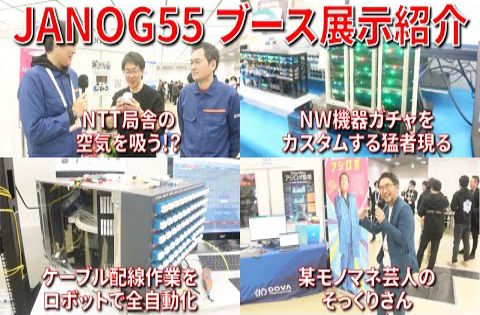

# show int レポート

## 動画名

1. [最先端技術 &amp; おもしろ技術ネタ が盛り沢山の JANOG55 企業展示ブースを現地レポート【JANOG55 後編】](https://www.youtube.com/watch?v=xdy8xWz9HRA)  
 ( 2025-04-01 公開)

1. [show int をはじめた理由を赤裸々に語ってみた](https://www.youtube.com/watch?v=HUUnXzY0_yY)  
 ( 2025-04-07 公開)

1. [モバイルネットワーク専門家が教える MVNO 超入門 【show int x レンジャーシステムズ コラボ企画】](https://www.youtube.com/watch?v=XuzoGeunmAA)  
 ( 2025-04-14 公開)

1. [現役ネットワークエンジニアが「得意なこと・苦手なこと」をさらけ出してみた](https://www.youtube.com/watch?v=DYRI4-y0i8Q)  
 ( 2025-04-22 公開)

1. [子育てエンジニアの苦悩。自己学習の時間が取れない『焦り』との付き合い方。](https://www.youtube.com/watch?v=v9035m7XD2Y)  
 ( 2025-04-28 公開)

1. [ネットワーク機器メーカーのユーザー会イベントに現地参加してみた 【show int x セイコーソリューションズ コラボ企画】](https://www.youtube.com/watch?v=LnBWaev5MVM)  
 ( 2025-05-05 公開)

1. [【講演】地方移住エンジニアが語る「地方移住者のホンネ」【3SNOG 現地レポート】](https://www.youtube.com/watch?v=2zmJXpfLkhA)  
 ( 2025-05-13 公開)

1. [オフィス回帰ブームでフルリモートワーク継続は困難になりつつある！？](https://www.youtube.com/watch?v=lAp_SqplcR4)  
 ( 2025-05-19 公開)

1. [ベテラン海外担当者が語る経験談「日本と海外のビジネス作法の違い」【前編】【show int x セイコーソリューションズ コラボ企画】](https://www.youtube.com/watch?v=9lQ2n_IiXw4)  
 ( 2025-05-26 公開)

1. [ベテラン海外担当者が語る経験談「海外ビジネスを失敗させないための秘訣」【後編】【show int x セイコーソリューションズ コラボ企画】](https://www.youtube.com/watch?v=CqSjyJWEkKk)  
 ( 2025-05-28 公開)

1. [広島大学で学生さんに向けて講演してきました【講演動画】【広島大学】](https://www.youtube.com/watch?v=semsfskyHl8)  
 ( 2025-06-02 公開)

1. [30代後半 転職未経験者からの人生相談「人生で一度は転職は経験しておくべきか？」について議論してみた](https://www.youtube.com/watch?v=9oG0PzstWmA)  
 ( 2025-06-09 公開)

1. [光ファイバー&amp;光トランシーバー  初心者向け講演をざっくり解説【JANOG55プログラム解説】](https://www.youtube.com/watch?v=cSzv2TTiIKg)  
 ( 2025-06-16 公開)

1. [開催直前！JANOG56 in 松江 の注目プログラムを紹介 【ネットワーク業界イベント】【カンファレンス】](https://www.youtube.com/watch?v=ytcuK826Fqc)  
 ( 2025-06-23 公開)

|||
|---|---|
|動画名|最先端技術 &amp; おもしろ技術ネタ が盛り沢山の JANOG55 企業展示ブースを現地レポート【JANOG55 後編】|
|動画URL|https://www.youtube.com/watch?v=xdy8xWz9HRA|
|動画公開日|2025-04-01|
|集計期間|2025-04-01 ~ 2025-08-13 ( 134 日間 ) |
|サムネイル||
|再生回数|716 回|
|グッド回数|19|
|バッド回数|0|
|インプレッション数| 0 回|
|インプレッションからのクリック率| 0 %|
|視聴者の年齢と性別| 男性: 100 %  女性: 0% 13～17 歳 0%        18～24 歳 0%        25～34 歳 64%        35～44 歳 36% 44～54 歳 0%        55～64 歳 0%        65 歳以上 0% |
|トラフィック流入元|show int 登録者へのおすすめ : 56.8%   show int チャンネルページ : 13.5% YouTube関連動画 : 2.7%    YouTube検索 : 3.4%   外部サイトからの流入 : 10.3%|

外部サイトからの流入の内訳
    facebook.com : 40.5%
    twitter.com : 17.5%
    office.net : 6.7%
    Google : 5.4%
    Naver : 5.4%
    Gmail : 4%
    live.com : 4%
    Google Search : 2.7%
    YouTube : 1.3%
    line.me : 1.3%

|||
|---|---|
|動画名|show int をはじめた理由を赤裸々に語ってみた|
|動画URL|https://www.youtube.com/watch?v=HUUnXzY0_yY|
|動画公開日|2025-04-07|
|集計期間|2025-04-07 ~ 2025-08-13 ( 128 日間 ) |
|サムネイル||
|再生回数|407 回|
|グッド回数|21|
|バッド回数|0|
|インプレッション数| 0 回|
|インプレッションからのクリック率| 0 %|
|視聴者の年齢と性別| 男性: 100 %  女性: 0% 13～17 歳 0%        18～24 歳 22.1%        25～34 歳 49.5%        35～44 歳 28.4% 44～54 歳 0%        55～64 歳 0%        65 歳以上 0% |
|トラフィック流入元|show int 登録者へのおすすめ : 59.4%   show int チャンネルページ : 10% YouTube関連動画 : 10.8%    YouTube検索 : 4.6%   外部サイトからの流入 : 5.6%|

外部サイトからの流入の内訳
    twitter.com : 43.4%
    facebook.com : 26%
    Yahoo Search : 8.6%
    Google : 4.3%
    Google Docs : 4.3%
    Google Search : 4.3%
    com.Slack : 4.3%

|||
|---|---|
|動画名|モバイルネットワーク専門家が教える MVNO 超入門 【show int x レンジャーシステムズ コラボ企画】|
|動画URL|https://www.youtube.com/watch?v=XuzoGeunmAA|
|動画公開日|2025-04-14|
|集計期間|2025-04-14 ~ 2025-08-13 ( 121 日間 ) |
|サムネイル||
|再生回数|831 回|
|グッド回数|29|
|バッド回数|0|
|インプレッション数| 0 回|
|インプレッションからのクリック率| 0 %|
|視聴者の年齢と性別| 男性: 100 %  女性: 0% 13～17 歳 0%        18～24 歳 0%        25～34 歳 55.7%        35～44 歳 44.3% 44～54 歳 0%        55～64 歳 0%        65 歳以上 0% |
|トラフィック流入元|show int 登録者へのおすすめ : 47.6%   show int チャンネルページ : 11.6% YouTube関連動画 : 9.1%    YouTube検索 : 4.2%   外部サイトからの流入 : 11.1%|

外部サイトからの流入の内訳
    twitter.com : 24.7%
    Google Search : 9.6%
    tocaro.im : 6.4%
    YouTube : 5.3%
    facebook.com : 4.3%
    Creator Studio : 3.2%
    Naver : 2.1%
    Yahoo Search : 2.1%
    org.mozilla.firefox : 1%

|||
|---|---|
|動画名|現役ネットワークエンジニアが「得意なこと・苦手なこと」をさらけ出してみた|
|動画URL|https://www.youtube.com/watch?v=DYRI4-y0i8Q|
|動画公開日|2025-04-22|
|集計期間|2025-04-22 ~ 2025-08-13 ( 113 日間 ) |
|サムネイル||
|再生回数|847 回|
|グッド回数|15|
|バッド回数|0|
|インプレッション数| 0 回|
|インプレッションからのクリック率| 0 %|
|視聴者の年齢と性別| 男性: 100 %  女性: 0% 13～17 歳 0%        18～24 歳 0%        25～34 歳 73.2%        35～44 歳 26.8% 44～54 歳 0%        55～64 歳 0%        65 歳以上 0% |
|トラフィック流入元|show int 登録者へのおすすめ : 50.1%   show int チャンネルページ : 7.6% YouTube関連動画 : 14.6%    YouTube検索 : 2.9%   外部サイトからの流入 : 10.6%|

外部サイトからの流入の内訳
    twitter.com : 40%
    linkedin.com : 21.1%
    facebook.com : 13.3%
    Google Search : 10%
    Google : 3.3%
    bing.com : 1.1%
    com.google.Dynamite : 1.1%

|||
|---|---|
|動画名|子育てエンジニアの苦悩。自己学習の時間が取れない『焦り』との付き合い方。|
|動画URL|https://www.youtube.com/watch?v=v9035m7XD2Y|
|動画公開日|2025-04-28|
|集計期間|2025-04-28 ~ 2025-08-13 ( 107 日間 ) |
|サムネイル||
|再生回数|493 回|
|グッド回数|14|
|バッド回数|0|
|インプレッション数| 0 回|
|インプレッションからのクリック率| 0 %|
|視聴者の年齢と性別| 男性: 100 %  女性: 0% 13～17 歳 0%        18～24 歳 0%        25～34 歳 100%        35～44 歳 0% 44～54 歳 0%        55～64 歳 0%        65 歳以上 0% |
|トラフィック流入元|show int 登録者へのおすすめ : 67.5%   show int チャンネルページ : 7.7% YouTube関連動画 : 8.9%    YouTube検索 : 1.2%   外部サイトからの流入 : 6.2%|

外部サイトからの流入の内訳
    twitter.com : 45.1%
    facebook.com : 32.2%
    Google Search : 6.4%
    Creator Studio : 3.2%
    YouTube : 3.2%
    twitter.android : 3.2%

|||
|---|---|
|動画名|ネットワーク機器メーカーのユーザー会イベントに現地参加してみた 【show int x セイコーソリューションズ コラボ企画】|
|動画URL|https://www.youtube.com/watch?v=LnBWaev5MVM|
|動画公開日|2025-05-05|
|集計期間|2025-05-05 ~ 2025-08-13 ( 100 日間 ) |
|サムネイル||
|再生回数|523 回|
|グッド回数|5|
|バッド回数|0|
|インプレッション数| 0 回|
|インプレッションからのクリック率| 0 %|
|視聴者の年齢と性別| 男性: 100 %  女性: 0% 13～17 歳 0%        18～24 歳 0%        25～34 歳 62.7%        35～44 歳 37.3% 44～54 歳 0%        55～64 歳 0%        65 歳以上 0% |
|トラフィック流入元|show int 登録者へのおすすめ : 48.7%   show int チャンネルページ : 10.5% YouTube関連動画 : 3%    YouTube検索 : 5.1%   外部サイトからの流入 : 13%|

外部サイトからの流入の内訳
    facebook.com : 32.3%
    twitter.com : 23.5%
    office.net : 11.7%
    Google Search : 7.3%
    com.Slack : 5.8%
    com.cisco.wx2.android : 1.4%
    hatenablog.jp : 1.4%
    line.me : 1.4%

|||
|---|---|
|動画名|【講演】地方移住エンジニアが語る「地方移住者のホンネ」【3SNOG 現地レポート】|
|動画URL|https://www.youtube.com/watch?v=2zmJXpfLkhA|
|動画公開日|2025-05-13|
|集計期間|2025-05-13 ~ 2025-08-13 ( 92 日間 ) |
|サムネイル||
|再生回数|552 回|
|グッド回数|14|
|バッド回数|0|
|インプレッション数| 0 回|
|インプレッションからのクリック率| 0 %|
|視聴者の年齢と性別| 男性: 100 %  女性: 0% 13～17 歳 0%        18～24 歳 0%        25～34 歳 55.4%        35～44 歳 44.6% 44～54 歳 0%        55～64 歳 0%        65 歳以上 0% |
|トラフィック流入元|show int 登録者へのおすすめ : 55.2%   show int チャンネルページ : 7.4% YouTube関連動画 : 5.7%    YouTube検索 : 3.8%   外部サイトからの流入 : 11.5%|

外部サイトからの流入の内訳
    facebook.com : 42.1%
    twitter.com : 21.8%
    Google Search : 12.5%
    facebook.messenger : 4.6%
    YouTube : 3.1%
    com.Slack : 1.5%

|||
|---|---|
|動画名|オフィス回帰ブームでフルリモートワーク継続は困難になりつつある！？|
|動画URL|https://www.youtube.com/watch?v=lAp_SqplcR4|
|動画公開日|2025-05-19|
|集計期間|2025-05-19 ~ 2025-08-13 ( 86 日間 ) |
|サムネイル||
|再生回数|750 回|
|グッド回数|21|
|バッド回数|0|
|インプレッション数| 0 回|
|インプレッションからのクリック率| 0 %|
|視聴者の年齢と性別| 男性: 100 %  女性: 0% 13～17 歳 0%        18～24 歳 0%        25～34 歳 58.4%        35～44 歳 27.5% 44～54 歳 14.1%        55～64 歳 0%        65 歳以上 0% |
|トラフィック流入元|show int 登録者へのおすすめ : 64.2%   show int チャンネルページ : 7.8% YouTube関連動画 : 6%    YouTube検索 : 3.3%   外部サイトからの流入 : 8.7%|

外部サイトからの流入の内訳
    facebook.com : 34.8%
    Google Search : 16.6%
    twitter.com : 15.1%
    Yahoo Search : 3%
    Creator Studio : 1.5%
    bing.com : 1.5%

|||
|---|---|
|動画名|ベテラン海外担当者が語る経験談「日本と海外のビジネス作法の違い」【前編】【show int x セイコーソリューションズ コラボ企画】|
|動画URL|https://www.youtube.com/watch?v=9lQ2n_IiXw4|
|動画公開日|2025-05-26|
|集計期間|2025-05-26 ~ 2025-08-13 ( 79 日間 ) |
|サムネイル||
|再生回数|429 回|
|グッド回数|11|
|バッド回数|0|
|インプレッション数| 0 回|
|インプレッションからのクリック率| 0 %|
|視聴者の年齢と性別| 男性: 100 %  女性: 0% 13～17 歳 0%        18～24 歳 0%        25～34 歳 55.4%        35～44 歳 44.6% 44～54 歳 0%        55～64 歳 0%        65 歳以上 0% |
|トラフィック流入元|show int 登録者へのおすすめ : 34.9%   show int チャンネルページ : 10.2% YouTube関連動画 : 20.7%    YouTube検索 : 3.9%   外部サイトからの流入 : 18.1%|

外部サイトからの流入の内訳
    twitter.com : 23%
    facebook.com : 21.7%
    sharepoint.com : 17.9%
    office.net : 11.5%
    Google Search : 10.2%
    cloud.microsoft : 6.4%
    YouTube : 2.5%
    Naver : 1.2%
    yammer.com : 1.2%

|||
|---|---|
|動画名|ベテラン海外担当者が語る経験談「海外ビジネスを失敗させないための秘訣」【後編】【show int x セイコーソリューションズ コラボ企画】|
|動画URL|https://www.youtube.com/watch?v=CqSjyJWEkKk|
|動画公開日|2025-05-28|
|集計期間|2025-05-28 ~ 2025-08-13 ( 77 日間 ) |
|サムネイル||
|再生回数|259 回|
|グッド回数|6|
|バッド回数|0|
|インプレッション数| 0 回|
|インプレッションからのクリック率| 0 %|
|視聴者の年齢と性別| 男性: 0 %  女性: 0% 13～17 歳 0%        18～24 歳 0%        25～34 歳 0%        35～44 歳 0% 44～54 歳 0%        55～64 歳 0%        65 歳以上 0% |
|トラフィック流入元|show int 登録者へのおすすめ : 42.4%   show int チャンネルページ : 10.4% YouTube関連動画 : 11.1%    YouTube検索 : 4.2%   外部サイトからの流入 : 19.3%|

外部サイトからの流入の内訳
    twitter.com : 40%
    facebook.com : 26%
    Google Search : 16%
    sharepoint.com : 6%
    Google : 2%
    Yahoo Search : 2%
    cloud.microsoft : 2%

|||
|---|---|
|動画名|広島大学で学生さんに向けて講演してきました【講演動画】【広島大学】|
|動画URL|https://www.youtube.com/watch?v=semsfskyHl8|
|動画公開日|2025-06-02|
|集計期間|2025-06-02 ~ 2025-08-13 ( 72 日間 ) |
|サムネイル||
|再生回数|450 回|
|グッド回数|10|
|バッド回数|0|
|インプレッション数| 0 回|
|インプレッションからのクリック率| 0 %|
|視聴者の年齢と性別| 男性: 100 %  女性: 0% 13～17 歳 0%        18～24 歳 0%        25～34 歳 57.1%        35～44 歳 42.9% 44～54 歳 0%        55～64 歳 0%        65 歳以上 0% |
|トラフィック流入元|show int 登録者へのおすすめ : 65.3%   show int チャンネルページ : 9.5% YouTube関連動画 : 6.2%    YouTube検索 : 1.1%   外部サイトからの流入 : 7.1%|

外部サイトからの流入の内訳
    twitter.com : 62.5%
    facebook.com : 15.6%
    Google Search : 6.2%
    Yahoo Search : 3.1%
    com.Slack : 3.1%
    threads.com : 3.1%

|||
|---|---|
|動画名|30代後半 転職未経験者からの人生相談「人生で一度は転職は経験しておくべきか？」について議論してみた|
|動画URL|https://www.youtube.com/watch?v=9oG0PzstWmA|
|動画公開日|2025-06-09|
|集計期間|2025-06-09 ~ 2025-08-13 ( 65 日間 ) |
|サムネイル||
|再生回数|427 回|
|グッド回数|6|
|バッド回数|0|
|インプレッション数| 0 回|
|インプレッションからのクリック率| 0 %|
|視聴者の年齢と性別| 男性: 100 %  女性: 0% 13～17 歳 0%        18～24 歳 0%        25～34 歳 60.8%        35～44 歳 39.2% 44～54 歳 0%        55～64 歳 0%        65 歳以上 0% |
|トラフィック流入元|show int 登録者へのおすすめ : 62.2%   show int チャンネルページ : 10.7% YouTube関連動画 : 3%    YouTube検索 : 2.3%   外部サイトからの流入 : 10.3%|

外部サイトからの流入の内訳
    facebook.com : 38.6%
    twitter.com : 25%
    Google Search : 13.6%
    Creator Studio : 4.5%
    com.instagram.barcelona : 2.2%

|||
|---|---|
|動画名|光ファイバー&amp;光トランシーバー  初心者向け講演をざっくり解説【JANOG55プログラム解説】|
|動画URL|https://www.youtube.com/watch?v=cSzv2TTiIKg|
|動画公開日|2025-06-16|
|集計期間|2025-06-16 ~ 2025-08-13 ( 58 日間 ) |
|サムネイル||
|再生回数|1329 回|
|グッド回数|54|
|バッド回数|0|
|インプレッション数| 0 回|
|インプレッションからのクリック率| 0 %|
|視聴者の年齢と性別| 男性: 100 %  女性: 0% 13～17 歳 0%        18～24 歳 6.6%        25～34 歳 46.5%        35～44 歳 34.2% 44～54 歳 12.7%        55～64 歳 0%        65 歳以上 0% |
|トラフィック流入元|show int 登録者へのおすすめ : 55.4%   show int チャンネルページ : 7.2% YouTube関連動画 : 12%    YouTube検索 : 6.6%   外部サイトからの流入 : 5.4%|

外部サイトからの流入の内訳
    twitter.com : 48.6%
    Google Search : 19.4%
    facebook.com : 8.3%
    bing.com : 5.5%
    office.net : 4.1%
    Yahoo Search : 2.7%
    YouTube : 1.3%

|||
|---|---|
|動画名|開催直前！JANOG56 in 松江 の注目プログラムを紹介 【ネットワーク業界イベント】【カンファレンス】|
|動画URL|https://www.youtube.com/watch?v=ytcuK826Fqc|
|動画公開日|2025-06-23|
|集計期間|2025-06-23 ~ 2025-08-13 ( 51 日間 ) |
|サムネイル||
|再生回数|502 回|
|グッド回数|8|
|バッド回数|0|
|インプレッション数| 0 回|
|インプレッションからのクリック率| 0 %|
|視聴者の年齢と性別| 男性: 100 %  女性: 0% 13～17 歳 0%        18～24 歳 0%        25～34 歳 38.9%        35～44 歳 30% 44～54 歳 31.1%        55～64 歳 0%        65 歳以上 0% |
|トラフィック流入元|show int 登録者へのおすすめ : 50.7%   show int チャンネルページ : 9.1% YouTube関連動画 : 6.5%    YouTube検索 : 13.1%   外部サイトからの流入 : 7.3%|

外部サイトからの流入の内訳
    twitter.com : 37.8%
    facebook.com : 18.9%
    Google Search : 8.1%
    com.Slack : 5.4%
    janog.gr.jp : 5.4%
    Creator Studio : 2.7%
    YouTube : 2.7%
    office.net : 2.7%

