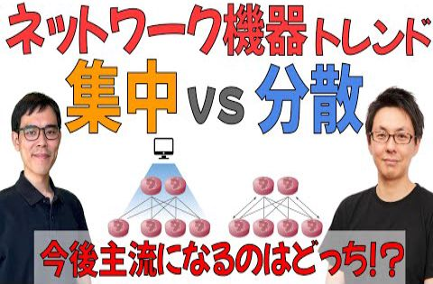
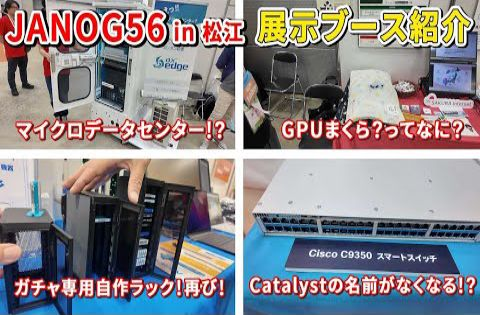

# show int レポート

## 動画名

1. [大阪関西万博2025に行ってきました](https://www.youtube.com/watch?v=_8LaXMVaHj0)  
 ( 2025-06-30 公開)

1. [20種類以上ある!? 100Gbps 光トランシーバー の正しい選び方を解説](https://www.youtube.com/watch?v=sNwNY7jkRYw)  
 ( 2025-07-07 公開)

1. [管理職を避け続けてきた現役エンジニアが自分のチームを立ち上げることになってしまった話](https://www.youtube.com/watch?v=gQJJM44a5mE)  
 ( 2025-07-14 公開)

1. [【１年ぶりの生配信】JANOG56講演に向けたテスト配信 &amp; 近況報告やります](https://www.youtube.com/watch?v=QUpRz3cYIxw)  
 ( 2025-07-19 公開)

1. [Nintendo Switch2 を初めてプレイする配信【はじめてのゲーム配信】](https://www.youtube.com/watch?v=46MW0bbkolM)  
 ( 2025-07-21 公開)

1. [朝活してたら、たまたま Nintendo Switch 2 が買えた話。2台。](https://www.youtube.com/watch?v=2q5wGbpl0kg)  
 ( 2025-07-21 公開)

1. [ChatGPT でルーターコンフィグを正しく作れるのか現役ネットワークエンジニアが検証してみた](https://www.youtube.com/watch?v=1lLySfl582U)  
 ( 2025-07-28 公開)

1. [【講演】新人のためのインターネット&amp;ネットワーク超入門2025 【JANOG56松江】【YouTubeLIVE】](https://www.youtube.com/watch?v=LvK2EqIX2KA)  
 ( 2025-07-30 公開)

1. [JANOG56 in 松江、 終了直後のホテルから現地の様子をふりかえってみた](https://www.youtube.com/watch?v=_FqlhXbzLMs)  
 ( 2025-08-04 公開)

1. [「集中管理 vs 分散管理」ネットワーク技術のトレンドを紐解く【JANOG55プログラム解説】](https://www.youtube.com/watch?v=qg9gG83Kg3k)  
 ( 2025-08-12 公開)

1. [はじめてのリーダー職で自信が持てない人へのアドバイス【人生相談】【質問コーナー】](https://www.youtube.com/watch?v=RfyRP1vphW0)  
 ( 2025-08-18 公開)

1. [「オンプレ」と「クラウド」をラクにつなぐ閉域接続サービスを解説してみた【show int x アット東京 コラボ企画】](https://www.youtube.com/watch?v=Kinac_z4UWY)  
 ( 2025-08-25 公開)

1. [国内最大のネットワーク業界カンファレンス JANOG56 in 松江 を現地レポート 【JANOG56 前編】](https://www.youtube.com/watch?v=sh5u0ANvvTs)  
 ( 2025-09-01 公開)

1. [JANOG56 in 松江の企業展示ブースを歩きまわる【JANOG56 後編】](https://www.youtube.com/watch?v=Y-CVCzwd5xU)  
 ( 2025-09-08 公開)

|||
|---|---|
|動画名|大阪関西万博2025に行ってきました|
|動画URL|https://www.youtube.com/watch?v=_8LaXMVaHj0|
|動画公開日|2025-06-30|
|集計期間|2025-06-30 ~ 2025-11-14 ( 137 日間 ) |
|サムネイル||
|再生回数|355 回|
|グッド回数|2|
|バッド回数|0|
|インプレッション数| 0 回|
|インプレッションからのクリック率| 0 %|
|視聴者の年齢と性別| 男性: 100 %  女性: 0% 13～17 歳 0%        18～24 歳 0%        25～34 歳 0%        35～44 歳 0% 44～54 歳 0%        55～64 歳 0%        65 歳以上 0% |
|トラフィック流入元|show int 登録者へのおすすめ : 49.5%   show int チャンネルページ : 10.4% YouTube関連動画 : 3.9%    YouTube検索 : 1.9%   外部サイトからの流入 : 21.9%|

外部サイトからの流入の内訳
    Google Search : 50%
    Yahoo Search : 15.3%
    twitter.com : 7.6%
    facebook.com : 3.8%
    docomo.ne.jp : 1.2%
    ytmp4.is : 1.2%

|||
|---|---|
|動画名|20種類以上ある!? 100Gbps 光トランシーバー の正しい選び方を解説|
|動画URL|https://www.youtube.com/watch?v=sNwNY7jkRYw|
|動画公開日|2025-07-07|
|集計期間|2025-07-07 ~ 2025-11-14 ( 130 日間 ) |
|サムネイル||
|再生回数|1105 回|
|グッド回数|30|
|バッド回数|0|
|インプレッション数| 0 回|
|インプレッションからのクリック率| 0 %|
|視聴者の年齢と性別| 男性: 100 %  女性: 0% 13～17 歳 0%        18～24 歳 0%        25～34 歳 57%        35～44 歳 43% 44～54 歳 0%        55～64 歳 0%        65 歳以上 0% |
|トラフィック流入元|show int 登録者へのおすすめ : 44.4%   show int チャンネルページ : 6.3% YouTube関連動画 : 11%    YouTube検索 : 6%   外部サイトからの流入 : 14.2%|

外部サイトからの流入の内訳
    twitter.com : 68.3%
    Google Search : 9.4%
    facebook.com : 3.7%
    cloud.microsoft : 3.1%
    Creator Studio : 2.5%
    YouTube : 2.5%
    Chrome : 0.6%
    Google : 0.6%
    Yahoo Search : 0.6%
    raindrop.io : 0.6%

|||
|---|---|
|動画名|管理職を避け続けてきた現役エンジニアが自分のチームを立ち上げることになってしまった話|
|動画URL|https://www.youtube.com/watch?v=gQJJM44a5mE|
|動画公開日|2025-07-14|
|集計期間|2025-07-14 ~ 2025-11-14 ( 123 日間 ) |
|サムネイル||
|再生回数|411 回|
|グッド回数|13|
|バッド回数|0|
|インプレッション数| 0 回|
|インプレッションからのクリック率| 0 %|
|視聴者の年齢と性別| 男性: 100 %  女性: 0% 13～17 歳 0%        18～24 歳 0%        25～34 歳 62.5%        35～44 歳 37.5% 44～54 歳 0%        55～64 歳 0%        65 歳以上 0% |
|トラフィック流入元|show int 登録者へのおすすめ : 61.3%   show int チャンネルページ : 9.4% YouTube関連動画 : 8.5%    YouTube検索 : 3.8%   外部サイトからの流入 : 5.8%|

外部サイトからの流入の内訳
    twitter.com : 50%
    facebook.com : 29.1%
    Creator Studio : 8.3%
    YouTube : 4.1%
    bing.com : 4.1%

|||
|---|---|
|動画名|【１年ぶりの生配信】JANOG56講演に向けたテスト配信 &amp; 近況報告やります|
|動画URL|https://www.youtube.com/watch?v=QUpRz3cYIxw|
|動画公開日|2025-07-19|
|集計期間|2025-07-19 ~ 2025-11-14 ( 118 日間 ) |
|サムネイル||
|再生回数|221 回|
|グッド回数|6|
|バッド回数|0|
|インプレッション数| 0 回|
|インプレッションからのクリック率| 0 %|
|視聴者の年齢と性別| 男性: 100 %  女性: 0% 13～17 歳 0%        18～24 歳 0%        25～34 歳 100%        35～44 歳 0% 44～54 歳 0%        55～64 歳 0%        65 歳以上 0% |
|トラフィック流入元|show int 登録者へのおすすめ : 78.2%   show int チャンネルページ : 3.6% YouTube関連動画 : 1.8%    YouTube検索 : 1.8%   外部サイトからの流入 : 3.6%|

外部サイトからの流入の内訳
    twitter.com : 75%
    Google Search : 12.5%
    msn.com : 12.5%

|||
|---|---|
|動画名|Nintendo Switch2 を初めてプレイする配信【はじめてのゲーム配信】|
|動画URL|https://www.youtube.com/watch?v=46MW0bbkolM|
|動画公開日|2025-07-21|
|集計期間|2025-07-21 ~ 2025-11-14 ( 116 日間 ) |
|サムネイル||
|再生回数|427 回|
|グッド回数|9|
|バッド回数|0|
|インプレッション数| 0 回|
|インプレッションからのクリック率| 0 %|
|視聴者の年齢と性別| 男性: 100 %  女性: 0% 13～17 歳 0%        18～24 歳 13.2%        25～34 歳 52.8%        35～44 歳 34% 44～54 歳 0%        55～64 歳 0%        65 歳以上 0% |
|トラフィック流入元|show int 登録者へのおすすめ : 81%   show int チャンネルページ : 3.9% YouTube関連動画 : 3.7%    YouTube検索 : 0.7%   外部サイトからの流入 : 7.2%|

外部サイトからの流入の内訳
    twitter.com : 61.2%
    Google Search : 9.6%
    Creator Studio : 6.4%
    Yahoo Search : 6.4%
    msn.com : 3.2%

|||
|---|---|
|動画名|朝活してたら、たまたま Nintendo Switch 2 が買えた話。2台。|
|動画URL|https://www.youtube.com/watch?v=2q5wGbpl0kg|
|動画公開日|2025-07-21|
|集計期間|2025-07-21 ~ 2025-11-14 ( 116 日間 ) |
|サムネイル||
|再生回数|1480 回|
|グッド回数|9|
|バッド回数|10|
|インプレッション数| 0 回|
|インプレッションからのクリック率| 0 %|
|視聴者の年齢と性別| 男性: 97.8 %  女性: 2.2% 13～17 歳 0%        18～24 歳 0%        25～34 歳 19.2%        35～44 歳 37.1% 44～54 歳 38.2%        55～64 歳 5.5%        65 歳以上 0% |
|トラフィック流入元|show int 登録者へのおすすめ : 69.7%   show int チャンネルページ : 1.7% YouTube関連動画 : 1.4%    YouTube検索 : 1.2%   外部サイトからの流入 : 22.8%|

外部サイトからの流入の内訳
    Google Search : 53.2%
    Yahoo Search : 7.6%
    facebook.com : 3.8%
    Creator Studio : 1.7%
    twitter.com : 1.1%
    rakuten.co.jp : 0.5%
    Google Docs : 0.2%
    bing.com : 0.2%

|||
|---|---|
|動画名|ChatGPT でルーターコンフィグを正しく作れるのか現役ネットワークエンジニアが検証してみた|
|動画URL|https://www.youtube.com/watch?v=1lLySfl582U|
|動画公開日|2025-07-28|
|集計期間|2025-07-28 ~ 2025-11-14 ( 109 日間 ) |
|サムネイル||
|再生回数|742 回|
|グッド回数|19|
|バッド回数|0|
|インプレッション数| 0 回|
|インプレッションからのクリック率| 0 %|
|視聴者の年齢と性別| 男性: 100 %  女性: 0% 13～17 歳 0%        18～24 歳 0%        25～34 歳 53%        35～44 歳 47% 44～54 歳 0%        55～64 歳 0%        65 歳以上 0% |
|トラフィック流入元|show int 登録者へのおすすめ : 55.5%   show int チャンネルページ : 10.6% YouTube関連動画 : 14.5%    YouTube検索 : 4.4%   外部サイトからの流入 : 6.8%|

外部サイトからの流入の内訳
    twitter.com : 64.7%
    Google Search : 11.7%
    facebook.com : 7.8%
    Creator Studio : 3.9%
    Google : 1.9%

|||
|---|---|
|動画名|【講演】新人のためのインターネット&amp;ネットワーク超入門2025 【JANOG56松江】【YouTubeLIVE】|
|動画URL|https://www.youtube.com/watch?v=LvK2EqIX2KA|
|動画公開日|2025-07-30|
|集計期間|2025-07-30 ~ 2025-11-14 ( 107 日間 ) |
|サムネイル||
|再生回数|2949 回|
|グッド回数|62|
|バッド回数|0|
|インプレッション数| 0 回|
|インプレッションからのクリック率| 0 %|
|視聴者の年齢と性別| 男性: 100 %  女性: 0% 13～17 歳 0%        18～24 歳 5.1%        25～34 歳 49%        35～44 歳 23.8% 44～54 歳 17.8%        55～64 歳 4.3%        65 歳以上 0% |
|トラフィック流入元|show int 登録者へのおすすめ : 29.2%   show int チャンネルページ : 2.9% YouTube関連動画 : 3.9%    YouTube検索 : 8.2%   外部サイトからの流入 : 33.6%|

外部サイトからの流入の内訳
    janog.gr.jp : 59.6%
    office.net : 4.7%
    twitter.com : 3.3%
    Google Search : 3%
    YouTube : 2.5%
    Google : 1%
    bing.com : 0.5%
    box.com : 0.5%
    metro-cit.ac.jp : 0.4%
    discord.com : 0.3%

|||
|---|---|
|動画名|JANOG56 in 松江、 終了直後のホテルから現地の様子をふりかえってみた|
|動画URL|https://www.youtube.com/watch?v=_FqlhXbzLMs|
|動画公開日|2025-08-04|
|集計期間|2025-08-04 ~ 2025-11-14 ( 102 日間 ) |
|サムネイル||
|再生回数|469 回|
|グッド回数|17|
|バッド回数|0|
|インプレッション数| 0 回|
|インプレッションからのクリック率| 0 %|
|視聴者の年齢と性別| 男性: 100 %  女性: 0% 13～17 歳 0%        18～24 歳 0%        25～34 歳 44.4%        35～44 歳 31.1% 44～54 歳 24.4%        55～64 歳 0%        65 歳以上 0% |
|トラフィック流入元|show int 登録者へのおすすめ : 55.6%   show int チャンネルページ : 9.1% YouTube関連動画 : 6.1%    YouTube検索 : 8.9%   外部サイトからの流入 : 11.9%|

外部サイトからの流入の内訳
    twitter.com : 35.7%
    facebook.com : 28.5%
    Google Search : 8.9%
    com.Slack : 5.3%
    Creator Studio : 3.5%
    janog.gr.jp : 3.5%
    YouTube : 1.7%

|||
|---|---|
|動画名|「集中管理 vs 分散管理」ネットワーク技術のトレンドを紐解く【JANOG55プログラム解説】|
|動画URL|https://www.youtube.com/watch?v=qg9gG83Kg3k|
|動画公開日|2025-08-12|
|集計期間|2025-08-12 ~ 2025-11-14 ( 94 日間 ) |
|サムネイル||
|再生回数|902 回|
|グッド回数|23|
|バッド回数|1|
|インプレッション数| 0 回|
|インプレッションからのクリック率| 0 %|
|視聴者の年齢と性別| 男性: 100 %  女性: 0% 13～17 歳 0%        18～24 歳 14.5%        25～34 歳 41.2%        35～44 歳 30.7% 44～54 歳 13.6%        55～64 歳 0%        65 歳以上 0% |
|トラフィック流入元|show int 登録者へのおすすめ : 56%   show int チャンネルページ : 7.8% YouTube関連動画 : 10.6%    YouTube検索 : 2.2%   外部サイトからの流入 : 8.5%|

外部サイトからの流入の内訳
    twitter.com : 85.7%
    Creator Studio : 2.5%
    facebook.com : 2.5%
    Gmail : 1.2%
    Google : 1.2%
    Google Search : 1.2%
    com.instagram.barcelona : 1.2%
    duckduckgo.com : 1.2%

|||
|---|---|
|動画名|はじめてのリーダー職で自信が持てない人へのアドバイス【人生相談】【質問コーナー】|
|動画URL|https://www.youtube.com/watch?v=RfyRP1vphW0|
|動画公開日|2025-08-18|
|集計期間|2025-08-18 ~ 2025-11-14 ( 88 日間 ) |
|サムネイル||
|再生回数|270 回|
|グッド回数|11|
|バッド回数|0|
|インプレッション数| 0 回|
|インプレッションからのクリック率| 0 %|
|視聴者の年齢と性別| 男性: 100 %  女性: 0% 13～17 歳 0%        18～24 歳 0%        25～34 歳 56.6%        35～44 歳 43.4% 44～54 歳 0%        55～64 歳 0%        65 歳以上 0% |
|トラフィック流入元|show int 登録者へのおすすめ : 54%   show int チャンネルページ : 12.9% YouTube関連動画 : 9.6%    YouTube検索 : 1.8%   外部サイトからの流入 : 6.2%|

外部サイトからの流入の内訳
    facebook.com : 47%
    twitter.com : 41.1%
    com.Slack : 5.8%

|||
|---|---|
|動画名|「オンプレ」と「クラウド」をラクにつなぐ閉域接続サービスを解説してみた【show int x アット東京 コラボ企画】|
|動画URL|https://www.youtube.com/watch?v=Kinac_z4UWY|
|動画公開日|2025-08-25|
|集計期間|2025-08-25 ~ 2025-11-14 ( 81 日間 ) |
|サムネイル||
|再生回数|845 回|
|グッド回数|17|
|バッド回数|0|
|インプレッション数| 0 回|
|インプレッションからのクリック率| 0 %|
|視聴者の年齢と性別| 男性: 100 %  女性: 0% 13～17 歳 0%        18～24 歳 0%        25～34 歳 52.7%        35～44 歳 31.5% 44～54 歳 15.8%        55～64 歳 0%        65 歳以上 0% |
|トラフィック流入元|show int 登録者へのおすすめ : 43.7%   show int チャンネルページ : 9.3% YouTube関連動画 : 3.3%    YouTube検索 : 4.1%   外部サイトからの流入 : 26.5%|

外部サイトからの流入の内訳
    sharepoint.com : 43.7%
    twitter.com : 16.5%
    office.net : 14.7%
    facebook.com : 12%
    Google Search : 1.7%
    YouTube : 1.7%
    cloud.microsoft : 1.3%
    Creator Studio : 0.8%
    Gmail : 0.8%
    Yahoo Search : 0.8%

|||
|---|---|
|動画名|国内最大のネットワーク業界カンファレンス JANOG56 in 松江 を現地レポート 【JANOG56 前編】|
|動画URL|https://www.youtube.com/watch?v=sh5u0ANvvTs|
|動画公開日|2025-09-01|
|集計期間|2025-09-01 ~ 2025-11-14 ( 74 日間 ) |
|サムネイル||
|再生回数|298 回|
|グッド回数|7|
|バッド回数|0|
|インプレッション数| 0 回|
|インプレッションからのクリック率| 0 %|
|視聴者の年齢と性別| 男性: 100 %  女性: 0% 13～17 歳 0%        18～24 歳 0%        25～34 歳 55.2%        35～44 歳 44.8% 44～54 歳 0%        55～64 歳 0%        65 歳以上 0% |
|トラフィック流入元|show int 登録者へのおすすめ : 55.3%   show int チャンネルページ : 15.7% YouTube関連動画 : 6%    YouTube検索 : 4.3%   外部サイトからの流入 : 8.7%|

外部サイトからの流入の内訳
    twitter.com : 42.3%
    Creator Studio : 7.6%
    com.Slack : 7.6%
    Google Search : 3.8%
    YouTube : 3.8%
    facebook.com : 3.8%

|||
|---|---|
|動画名|JANOG56 in 松江の企業展示ブースを歩きまわる【JANOG56 後編】|
|動画URL|https://www.youtube.com/watch?v=Y-CVCzwd5xU|
|動画公開日|2025-09-08|
|集計期間|2025-09-08 ~ 2025-11-14 ( 67 日間 ) |
|サムネイル||
|再生回数|429 回|
|グッド回数|7|
|バッド回数|0|
|インプレッション数| 0 回|
|インプレッションからのクリック率| 0 %|
|視聴者の年齢と性別| 男性: 100 %  女性: 0% 13～17 歳 0%        18～24 歳 0%        25～34 歳 56.1%        35～44 歳 43.9% 44～54 歳 0%        55～64 歳 0%        65 歳以上 0% |
|トラフィック流入元|show int 登録者へのおすすめ : 54.3%   show int チャンネルページ : 13.7% YouTube関連動画 : 3%    YouTube検索 : 4.4%   外部サイトからの流入 : 12.8%|

外部サイトからの流入の内訳
    facebook.com : 49%
    twitter.com : 20%
    office.net : 9%
    Creator Studio : 7.2%
    Google Search : 5.4%
    Naver : 1.8%

