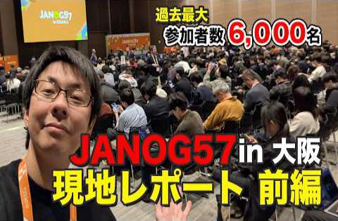
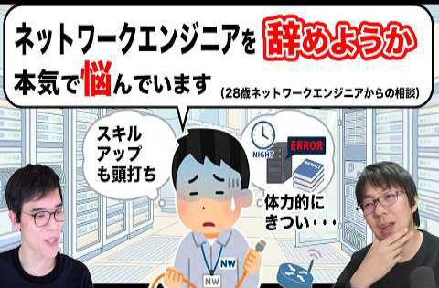

# show int レポート

## 動画名

1. [ネットワーク業界関係者 6000名が集まった JANOG57 in 大阪  に現地参加してきました 【JANOG57前編】](https://www.youtube.com/watch?v=Kgq6-xUBAD8)  
 ( 2026-04-06 公開)

1. [JANOG57 in 大阪 に集まるネットワーク業界の企業展示ブースを散策してきました 【JANOG57後編】](https://www.youtube.com/watch?v=fLCwanCxniM)  
 ( 2026-04-13 公開)

1. [KDDI新入社員が作った!! 遊んで学べる ネットワークボードゲームを現地レポート 【JANOG57 BoF】](https://www.youtube.com/watch?v=n20srMkJuPA)  
 ( 2026-04-20 公開)

1. [市販品なのに規格外!? 国内メーカーが語る LANケーブル のトラブル事例【JANOG57プログラム解説】](https://www.youtube.com/watch?v=Df-6ElLx7V0)  
 ( 2026-04-27 公開)

1. [責任の重いチームリーダーの役割になったときに家族の存在に助けられた話](https://www.youtube.com/watch?v=jMaE0dvmmjY)  
 ( 2026-05-04 公開)

1. [ネットワークエンジニアを辞めようと思ったことある？【人生相談】](https://www.youtube.com/watch?v=QkMnhxv5yY8)  
 ( 2026-05-11 公開)

1. [生成AI向けデータセンター 、普通のDCと何が違うの？](https://www.youtube.com/watch?v=nebaHUZSPUA)  
 ( 2026-05-18 公開)

1. [総額10万円以上の自宅10Gbpsネットワークを数ヶ月使ってみた感想](https://www.youtube.com/watch?v=vAKmvVeUAn8)  
 ( 2026-05-26 公開)

1. [実力のあるネットワークエンジニアは、なぜ転職しないのか](https://www.youtube.com/watch?v=DXywOKGX5aU)  
 ( 2026-06-01 公開)

1. [『理想のエンジニア』を採用するには、何をするべきか。何をやってはいけないか。](https://www.youtube.com/watch?v=P4JHBQlGK4M)  
 ( 2026-06-08 公開)

1. [現役ネットワークエンジニアが『インターネットの絵本』を作りたくなった話](https://www.youtube.com/watch?v=xqTUhtzpGV4)  
 ( 2026-06-15 公開)

1. [現役エンジニアが実践する在宅ワーク中の効率の良い『休憩時間』の過ごし方](https://www.youtube.com/watch?v=G1latybZrEE)  
 ( 2026-06-22 公開)

1. [変化の激しいAIデータセンター最新技術のキャッチアップに苦労している話](https://www.youtube.com/watch?v=TBEpi0Vp5t4)  
 ( 2026-06-29 公開)

1. [コンテンツ充実しすぎ!? JANOG58 in 愛媛 松山 の発表タイムテーブルを眺めてみよう【開催直前!! JANOG58 松山 7/15(水)~17(金)】](https://www.youtube.com/watch?v=ruLrwkFUHtc)  
 ( 2026-07-06 公開)

1. [【講演】新人のためのインターネット&amp;ネットワーク超入門2026 【JANOG58 愛媛 松山】【YouTubeLIVE】](https://www.youtube.com/watch?v=RW42o2yGoUc)  
 ( 2026-07-09 公開)

|||
|---|---|
|動画名|ネットワーク業界関係者 6000名が集まった JANOG57 in 大阪  に現地参加してきました 【JANOG57前編】|
|動画URL|https://www.youtube.com/watch?v=Kgq6-xUBAD8|
|動画公開日|2026-04-06|
|集計期間|2026-04-06 ~ 2026-07-12 ( 97 日間 ) |
|サムネイル||
|再生回数|615 回|
|グッド回数|14|
|バッド回数|0|
|インプレッション数|12451 回|
|インプレッションからのクリック率|3.41 %|
|視聴者の年齢と性別| 男性: 100 %  女性: 0% 13～17 歳 0%        18～24 歳 0%        25～34 歳 61.3%        35～44 歳 38.7% 44～54 歳 0%        55～64 歳 0%        65 歳以上 0% |
|トラフィック流入元|show int 登録者へのおすすめ : 63%   show int チャンネルページ : 10.8% YouTube関連動画 : 9.7%    YouTube検索 : 2.1%   外部サイトからの流入 : 4.5%|

外部サイトからの流入の内訳
    twitter.com : 82.1%
    Google Search : 3.5%
    facebook.com : 3.5%
    inoreader.com : 3.5%

|||
|---|---|
|動画名|JANOG57 in 大阪 に集まるネットワーク業界の企業展示ブースを散策してきました 【JANOG57後編】|
|動画URL|https://www.youtube.com/watch?v=fLCwanCxniM|
|動画公開日|2026-04-13|
|集計期間|2026-04-13 ~ 2026-07-12 ( 90 日間 ) |
|サムネイル||
|再生回数|498 回|
|グッド回数|15|
|バッド回数|0|
|インプレッション数|8981 回|
|インプレッションからのクリック率|3.34 %|
|視聴者の年齢と性別| 男性: 100 %  女性: 0% 13～17 歳 0%        18～24 歳 0%        25～34 歳 60%        35～44 歳 40% 44～54 歳 0%        55～64 歳 0%        65 歳以上 0% |
|トラフィック流入元|show int 登録者へのおすすめ : 60.4%   show int チャンネルページ : 9.4% YouTube関連動画 : 7.2%    YouTube検索 : 2.6%   外部サイトからの流入 : 7%|

外部サイトからの流入の内訳
    twitter.com : 71.4%
    Google Search : 5.7%
    Creator Studio : 2.8%
    com.microsoft.teams : 2.8%
    facebook.com : 2.8%

|||
|---|---|
|動画名|KDDI新入社員が作った!! 遊んで学べる ネットワークボードゲームを現地レポート 【JANOG57 BoF】|
|動画URL|https://www.youtube.com/watch?v=n20srMkJuPA|
|動画公開日|2026-04-20|
|集計期間|2026-04-20 ~ 2026-07-12 ( 83 日間 ) |
|サムネイル||
|再生回数|545 回|
|グッド回数|17|
|バッド回数|0|
|インプレッション数|8696 回|
|インプレッションからのクリック率|3.73 %|
|視聴者の年齢と性別| 男性: 100 %  女性: 0% 13～17 歳 0%        18～24 歳 0%        25～34 歳 59.8%        35～44 歳 40.2% 44～54 歳 0%        55～64 歳 0%        65 歳以上 0% |
|トラフィック流入元|show int 登録者へのおすすめ : 57.9%   show int チャンネルページ : 11% YouTube関連動画 : 2.5%    YouTube検索 : 3.3%   外部サイトからの流入 : 15.5%|

外部サイトからの流入の内訳
    office.net : 21.1%
    twitter.com : 12.9%
    janog.gr.jp : 11.7%
    Google Search : 4.7%
    facebook.com : 4.7%
    com.microsoft.teams : 2.3%
    youtu.be : 2.3%
    com.sonyericsson.android.camera : 1.1%
    discord.com : 1.1%
    static.microsoft : 1.1%

|||
|---|---|
|動画名|市販品なのに規格外!? 国内メーカーが語る LANケーブル のトラブル事例【JANOG57プログラム解説】|
|動画URL|https://www.youtube.com/watch?v=Df-6ElLx7V0|
|動画公開日|2026-04-27|
|集計期間|2026-04-27 ~ 2026-07-12 ( 76 日間 ) |
|サムネイル||
|再生回数|788 回|
|グッド回数|26|
|バッド回数|0|
|インプレッション数|11984 回|
|インプレッションからのクリック率|3.37 %|
|視聴者の年齢と性別| 男性: 100 %  女性: 0% 13～17 歳 0%        18～24 歳 0%        25～34 歳 56.5%        35～44 歳 26.7% 44～54 歳 16.8%        55～64 歳 0%        65 歳以上 0% |
|トラフィック流入元|show int 登録者へのおすすめ : 47.3%   show int チャンネルページ : 7.3% YouTube関連動画 : 13.1%    YouTube検索 : 2.7%   外部サイトからの流入 : 11.8%|

外部サイトからの流入の内訳
    twitter.com : 88.1%
    Chrome : 2.1%
    Google Search : 2.1%
    Creator Studio : 1%
    Discord : 1%

|||
|---|---|
|動画名|責任の重いチームリーダーの役割になったときに家族の存在に助けられた話|
|動画URL|https://www.youtube.com/watch?v=jMaE0dvmmjY|
|動画公開日|2026-05-04|
|集計期間|2026-05-04 ~ 2026-07-12 ( 69 日間 ) |
|サムネイル||
|再生回数|227 回|
|グッド回数|4|
|バッド回数|1|
|インプレッション数|5928 回|
|インプレッションからのクリック率|2.40 %|
|視聴者の年齢と性別| 男性: 100 %  女性: 0% 13～17 歳 0%        18～24 歳 0%        25～34 歳 52.3%        35～44 歳 47.7% 44～54 歳 0%        55～64 歳 0%        65 歳以上 0% |
|トラフィック流入元|show int 登録者へのおすすめ : 61.6%   show int チャンネルページ : 14.9% YouTube関連動画 : 2.6%    YouTube検索 : 3%   外部サイトからの流入 : 2.6%|

外部サイトからの流入の内訳
    twitter.com : 83.3%
    Creator Studio : 16.6%

|||
|---|---|
|動画名|ネットワークエンジニアを辞めようと思ったことある？【人生相談】|
|動画URL|https://www.youtube.com/watch?v=QkMnhxv5yY8|
|動画公開日|2026-05-11|
|集計期間|2026-05-11 ~ 2026-07-12 ( 62 日間 ) |
|サムネイル||
|再生回数|1854 回|
|グッド回数|28|
|バッド回数|2|
|インプレッション数|32179 回|
|インプレッションからのクリック率|3.75 %|
|視聴者の年齢と性別| 男性: 100 %  女性: 0% 13～17 歳 0%        18～24 歳 9.4%        25～34 歳 64.3%        35～44 歳 20.5% 44～54 歳 5.8%        55～64 歳 0%        65 歳以上 0% |
|トラフィック流入元|show int 登録者へのおすすめ : 66.8%   show int チャンネルページ : 5% YouTube関連動画 : 3.6%    YouTube検索 : 3.1%   外部サイトからの流入 : 13.5%|

外部サイトからの流入の内訳
    twitter.com : 96.4%
    Google Search : 1.1%
    Chrome : 0.3%
    Creator Studio : 0.3%
    discord.com : 0.3%
    office.net : 0.3%

|||
|---|---|
|動画名|生成AI向けデータセンター 、普通のDCと何が違うの？|
|動画URL|https://www.youtube.com/watch?v=nebaHUZSPUA|
|動画公開日|2026-05-18|
|集計期間|2026-05-18 ~ 2026-07-12 ( 55 日間 ) |
|サムネイル||
|再生回数|634 回|
|グッド回数|29|
|バッド回数|1|
|インプレッション数|11498 回|
|インプレッションからのクリック率|3.76 %|
|視聴者の年齢と性別| 男性: 100 %  女性: 0% 13～17 歳 0%        18～24 歳 0%        25～34 歳 44.9%        35～44 歳 55.1% 44～54 歳 0%        55～64 歳 0%        65 歳以上 0% |
|トラフィック流入元|show int 登録者へのおすすめ : 62.4%   show int チャンネルページ : 9.4% YouTube関連動画 : 7.2%    YouTube検索 : 4.4%   外部サイトからの流入 : 4.2%|

外部サイトからの流入の内訳
    twitter.com : 74%
    Google Search : 7.4%
    Chrome : 3.7%

|||
|---|---|
|動画名|総額10万円以上の自宅10Gbpsネットワークを数ヶ月使ってみた感想|
|動画URL|https://www.youtube.com/watch?v=vAKmvVeUAn8|
|動画公開日|2026-05-26|
|集計期間|2026-05-26 ~ 2026-07-12 ( 47 日間 ) |
|サムネイル||
|再生回数|1893 回|
|グッド回数|28|
|バッド回数|2|
|インプレッション数|26873 回|
|インプレッションからのクリック率|4.94 %|
|視聴者の年齢と性別| 男性: 100 %  女性: 0% 13～17 歳 0%        18～24 歳 9%        25～34 歳 50.7%        35～44 歳 29.2% 44～54 歳 11.1%        55～64 歳 0%        65 歳以上 0% |
|トラフィック流入元|show int 登録者へのおすすめ : 78%   show int チャンネルページ : 2.9% YouTube関連動画 : 4.8%    YouTube検索 : 1.1%   外部サイトからの流入 : 5.8%|

外部サイトからの流入の内訳
    twitter.com : 86.3%
    Google Search : 1.8%
    Creator Studio : 0.9%
    Discord : 0.9%
    jp.co.yahoo.android.yjtop : 0.9%
    m : 0.9%

|||
|---|---|
|動画名|実力のあるネットワークエンジニアは、なぜ転職しないのか|
|動画URL|https://www.youtube.com/watch?v=DXywOKGX5aU|
|動画公開日|2026-06-01|
|集計期間|2026-06-01 ~ 2026-07-12 ( 41 日間 ) |
|サムネイル||
|再生回数|730 回|
|グッド回数|14|
|バッド回数|0|
|インプレッション数|11108 回|
|インプレッションからのクリック率|4.76 %|
|視聴者の年齢と性別| 男性: 100 %  女性: 0% 13～17 歳 0%        18～24 歳 0%        25～34 歳 49.2%        35～44 歳 39% 44～54 歳 11.8%        55～64 歳 0%        65 歳以上 0% |
|トラフィック流入元|show int 登録者へのおすすめ : 62.7%   show int チャンネルページ : 8.6% YouTube関連動画 : 11.2%    YouTube検索 : 6.1%   外部サイトからの流入 : 2.7%|

外部サイトからの流入の内訳
    twitter.com : 85%
    Google Search : 5%
    cybozu.com : 5%

|||
|---|---|
|動画名|『理想のエンジニア』を採用するには、何をするべきか。何をやってはいけないか。|
|動画URL|https://www.youtube.com/watch?v=P4JHBQlGK4M|
|動画公開日|2026-06-08|
|集計期間|2026-06-08 ~ 2026-07-12 ( 34 日間 ) |
|サムネイル||
|再生回数|379 回|
|グッド回数|6|
|バッド回数|0|
|インプレッション数|7678 回|
|インプレッションからのクリック率|2.94 %|
|視聴者の年齢と性別| 男性: 100 %  女性: 0% 13～17 歳 0%        18～24 歳 0%        25～34 歳 47.6%        35～44 歳 52.4% 44～54 歳 0%        55～64 歳 0%        65 歳以上 0% |
|トラフィック流入元|show int 登録者へのおすすめ : 61.2%   show int チャンネルページ : 10.8% YouTube関連動画 : 7.6%    YouTube検索 : 3.6%   外部サイトからの流入 : 3.1%|

外部サイトからの流入の内訳
    twitter.com : 33.3%
    facebook.com : 25%
    Creator Studio : 16.6%
    cybozu.com : 16.6%

|||
|---|---|
|動画名|現役ネットワークエンジニアが『インターネットの絵本』を作りたくなった話|
|動画URL|https://www.youtube.com/watch?v=xqTUhtzpGV4|
|動画公開日|2026-06-15|
|集計期間|2026-06-15 ~ 2026-07-12 ( 27 日間 ) |
|サムネイル||
|再生回数|368 回|
|グッド回数|22|
|バッド回数|1|
|インプレッション数|7184 回|
|インプレッションからのクリック率|3.30 %|
|視聴者の年齢と性別| 男性: 100 %  女性: 0% 13～17 歳 0%        18～24 歳 0%        25～34 歳 52.3%        35～44 歳 47.7% 44～54 歳 0%        55～64 歳 0%        65 歳以上 0% |
|トラフィック流入元|show int 登録者へのおすすめ : 63.8%   show int チャンネルページ : 7.6% YouTube関連動画 : 7.6%    YouTube検索 : 2.1%   外部サイトからの流入 : 7%|

外部サイトからの流入の内訳
    twitter.com : 69.2%
    facebook.com : 19.2%
    Google Search : 7.6%
    Creator Studio : 3.8%

|||
|---|---|
|動画名|現役エンジニアが実践する在宅ワーク中の効率の良い『休憩時間』の過ごし方|
|動画URL|https://www.youtube.com/watch?v=G1latybZrEE|
|動画公開日|2026-06-22|
|集計期間|2026-06-22 ~ 2026-07-12 ( 20 日間 ) |
|サムネイル||
|再生回数|187 回|
|グッド回数|6|
|バッド回数|0|
|インプレッション数|4537 回|
|インプレッションからのクリック率|2.42 %|
|視聴者の年齢と性別| 男性: 100 %  女性: 0% 13～17 歳 0%        18～24 歳 0%        25～34 歳 100%        35～44 歳 0% 44～54 歳 0%        55～64 歳 0%        65 歳以上 0% |
|トラフィック流入元|show int 登録者へのおすすめ : 64.1%   show int チャンネルページ : 11.2% YouTube関連動画 : 3.2%    YouTube検索 : 2.1%   外部サイトからの流入 : 3.7%|

外部サイトからの流入の内訳
    twitter.com : 42.8%
    Creator Studio : 14.2%
    facebook.com : 14.2%
    m : 14.2%

|||
|---|---|
|動画名|変化の激しいAIデータセンター最新技術のキャッチアップに苦労している話|
|動画URL|https://www.youtube.com/watch?v=TBEpi0Vp5t4|
|動画公開日|2026-06-29|
|集計期間|2026-06-29 ~ 2026-07-12 ( 13 日間 ) |
|サムネイル||
|再生回数|302 回|
|グッド回数|6|
|バッド回数|1|
|インプレッション数|6100 回|
|インプレッションからのクリック率|3.25 %|
|視聴者の年齢と性別| 男性: 100 %  女性: 0% 13～17 歳 0%        18～24 歳 0%        25～34 歳 50.8%        35～44 歳 49.2% 44～54 歳 0%        55～64 歳 0%        65 歳以上 0% |
|トラフィック流入元|show int 登録者へのおすすめ : 72.5%   show int チャンネルページ : 5.9% YouTube関連動画 : 4.9%    YouTube検索 : 3.3%   外部サイトからの流入 : 1.3%|

外部サイトからの流入の内訳
    twitter.com : 75%
    Creator Studio : 25%

|||
|---|---|
|動画名|コンテンツ充実しすぎ!? JANOG58 in 愛媛 松山 の発表タイムテーブルを眺めてみよう【開催直前!! JANOG58 松山 7/15(水)~17(金)】|
|動画URL|https://www.youtube.com/watch?v=ruLrwkFUHtc|
|動画公開日|2026-07-06|
|集計期間|2026-07-06 ~ 2026-07-12 ( 6 日間 ) |
|サムネイル||
|再生回数|268 回|
|グッド回数|12|
|バッド回数|1|
|インプレッション数|5134 回|
|インプレッションからのクリック率|3.25 %|
|視聴者の年齢と性別| 男性: 100 %  女性: 0% 13～17 歳 0%        18～24 歳 0%        25～34 歳 66.2%        35～44 歳 33.8% 44～54 歳 0%        55～64 歳 0%        65 歳以上 0% |
|トラフィック流入元|show int 登録者へのおすすめ : 54.4%   show int チャンネルページ : 7% YouTube関連動画 : 5.5%    YouTube検索 : 6.7%   外部サイトからの流入 : 11.9%|

外部サイトからの流入の内訳
    twitter.com : 43.7%
    facebook.com : 37.5%
    Google : 6.2%
    Creator Studio : 3.1%
    m : 3.1%

|||
|---|---|
|動画名|【講演】新人のためのインターネット&amp;ネットワーク超入門2026 【JANOG58 愛媛 松山】【YouTubeLIVE】|
|動画URL|https://www.youtube.com/watch?v=RW42o2yGoUc|
|動画公開日|2026-07-09|
|集計期間|2026-07-09 ~ 2026-07-12 ( 3 日間 ) |
|サムネイル||
|再生回数|0 回|
|グッド回数|0|
|バッド回数|0|
|インプレッション数|0 回|
|インプレッションからのクリック率|0.00 %|
|視聴者の年齢と性別| 男性: 0 %  女性: 0% 13～17 歳 0%        18～24 歳 0%        25～34 歳 0%        35～44 歳 0% 44～54 歳 0%        55～64 歳 0%        65 歳以上 0% |
|トラフィック流入元|show int 登録者へのおすすめ : 0%   show int チャンネルページ : 0% YouTube関連動画 : 0%    YouTube検索 : 0%   外部サイトからの流入 : 0%|

外部サイトからの流入の内訳

