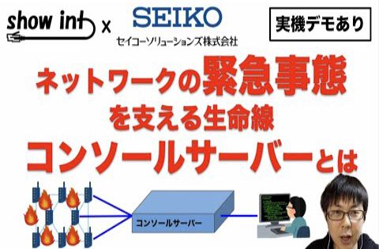
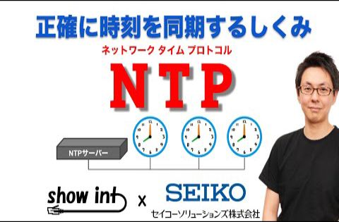

1. [ネットワークの緊急事態を支える装置 「コンソールサーバー」について解説してみました【実機デモあり】【show int x セイコーソリューションズ コラボ企画】](https://www.youtube.com/watch?v=Pm6nPx1_rKE)  
 ( 2021-03-15 公開)
1. [【エンジニア対談】開発エンジニア 中山 真一さんにネットワーク機器の開発の裏側について聞いてみました。【show int x セイコーソリューションズ コラボ企画】](https://www.youtube.com/watch?v=3gTQ1qwfQds)  
 ( 2021-04-12 公開)
1. [知らないと大障害の可能性も！？「NTP（ネットワークタイムプロトコル）」について解説してみました 【show int x セイコーソリューションズ コラボ企画】](https://www.youtube.com/watch?v=vi7n-dzo38U)  
 ( 2021-06-28 公開)
1. [旧世代ネットワーク機器へのゼロタッチ・プロビジョニング(初期設定の自動化)を実現しました【デモあり】](https://www.youtube.com/watch?v=y3G37mJ4bmc)  
 ( 2021-12-13 公開)
1. [サイバー攻撃の最新事情！ DRDoS攻撃 / NTP増幅攻撃 を解説してみた。](https://www.youtube.com/watch?v=MsyDH9ZUero)  
 ( 2022-04-25 公開)
1. [API が存在しないレガシー機器をネットワーク自動化する裏ワザ【デモあり】【SmartCS API 活用術】](https://www.youtube.com/watch?v=qWMwl6M3-_8)  
 ( 2022-06-13 公開)
1. [ニコニコ超会議2022で実践されたネットワーク自動化事例【セイコーソリューションズ コラボ企画】](https://www.youtube.com/watch?v=TcsWTS5qBzI)  
 ( 2023-05-22 公開)
1. [「踏み台サーバー」ってなに？ 運用失敗あるある事例と最新動向 【show int x セイコーソリューションズ コラボ企画】](https://www.youtube.com/watch?v=NU-2aNYGFd4)  
 ( 2024-01-15 公開)
 1. [Console Server : Remote Access Device for Routers & Switches](https://www.youtube.com/watch?v=NHdm1Xd2svI)  
 ( 2024-08-22 公開)
1. [時刻同期技術の最前線 IEEE ISPCS2024 参加レポート 【show int x セイコーソリューションズ コラボ企画】](https://www.youtube.com/watch?v=JqYM5B6xqac)  
 ( 2025-01-13 公開)

|||
|---|---|
|動画名|ネットワークの緊急事態を支える装置 「コンソールサーバー」について解説してみました【実機デモあり】【show int x セイコーソリューションズ コラボ企画】|
|動画URL|https://www.youtube.com/watch?v=Pm6nPx1_rKE|
|動画公開日|2021-03-15|
|集計期間|2021-03-15 ~ 2025-03-21 ( 1467 日間 ) |
|サムネイル||
|再生回数|2504 回|
|グッド回数|66|
|バッド回数|3|
|インプレッション数| 0 回|
|インプレッションからのクリック率| 0 %|
|視聴者の年齢と性別| 男性: 0 %  女性: 0% 13～17 歳 0%        18～24 歳 0%        25～34 歳 0%        35～44 歳 0% 44～54 歳 0%        55～64 歳 0%        65 歳以上 0% |
|トラフィック流入元|show int 登録者へのおすすめ : 33.5%   show int チャンネルページ : 8.5% YouTube関連動画 : 24.3%    YouTube検索 : 8.7%   外部サイトからの流入 : 9.3%|

外部サイトからの流入の内訳
    Google Search : 44.2%
    twitter.com : 19.5%
    facebook.com : 10.2%
    tocaro.im : 2.1%
    Yahoo Search : 1.7%
    YouTube : 1.7%
    bing.com : 1.7%
    com.apple.mobilesafari-smartbanner : 1.7%
    office.net : 0.8%
    Google : 0.4%

|||
|---|---|
|動画名|【エンジニア対談】開発エンジニア 中山 真一さんにネットワーク機器の開発の裏側について聞いてみました。【show int x セイコーソリューションズ コラボ企画】|
|動画URL|https://www.youtube.com/watch?v=3gTQ1qwfQds|
|動画公開日|2021-04-12|
|集計期間|2021-04-12 ~ 2025-03-21 ( 1439 日間 ) |
|サムネイル||
|再生回数|849 回|
|グッド回数|16|
|バッド回数|0|
|インプレッション数| 0 回|
|インプレッションからのクリック率| 0 %|
|視聴者の年齢と性別| 男性: 100 %  女性: 0% 13～17 歳 0%        18～24 歳 0%        25～34 歳 100%        35～44 歳 0% 44～54 歳 0%        55～64 歳 0%        65 歳以上 0% |
|トラフィック流入元|show int 登録者へのおすすめ : 28%   show int チャンネルページ : 10.8% YouTube関連動画 : 9.3%    YouTube検索 : 31.6%   外部サイトからの流入 : 8.5%|

外部サイトからの流入の内訳
    Google Search : 38.3%
    twitter.com : 24.6%
    facebook.com : 8.2%
    manaba.jp : 2.7%
    Gmail : 1.3%
    Google Docs : 1.3%
    Yahoo Search : 1.3%
    bing.com : 1.3%

|||
|---|---|
|動画名|知らないと大障害の可能性も！？「NTP（ネットワークタイムプロトコル）」について解説してみました 【show int x セイコーソリューションズ コラボ企画】|
|動画URL|https://www.youtube.com/watch?v=vi7n-dzo38U|
|動画公開日|2021-06-28|
|集計期間|2021-06-28 ~ 2025-03-21 ( 1362 日間 ) |
|サムネイル||
|再生回数|4523 回|
|グッド回数|69|
|バッド回数|5|
|インプレッション数| 0 回|
|インプレッションからのクリック率| 0 %|
|視聴者の年齢と性別| 男性: 100 %  女性: 0% 13～17 歳 0%        18～24 歳 0%        25～34 歳 0%        35～44 歳 100% 44～54 歳 0%        55～64 歳 0%        65 歳以上 0% |
|トラフィック流入元|show int 登録者へのおすすめ : 18.5%   show int チャンネルページ : 4.2% YouTube関連動画 : 25.3%    YouTube検索 : 32.8%   外部サイトからの流入 : 9.5%|

外部サイトからの流入の内訳
    Google Search : 67.3%
    Yahoo Search : 6%
    facebook.com : 3.9%
    bing.com : 3.2%
    twitter.com : 3%
    YouTube : 1.3%
    com.google.android.apps.docs : 0.4%
    Google : 0.2%
    com.apple.mobilesafari-smartbanner : 0.2%
    hatenablog.jp : 0.2%

|||
|---|---|
|動画名|旧世代ネットワーク機器へのゼロタッチ・プロビジョニング(初期設定の自動化)を実現しました【デモあり】|
|動画URL|https://www.youtube.com/watch?v=y3G37mJ4bmc|
|動画公開日|2021-12-13|
|集計期間|2021-12-13 ~ 2025-03-21 ( 1194 日間 ) |
|サムネイル||
|再生回数|1055 回|
|グッド回数|39|
|バッド回数|0|
|インプレッション数| 0 回|
|インプレッションからのクリック率| 0 %|
|視聴者の年齢と性別| 男性: 100 %  女性: 0% 13～17 歳 0%        18～24 歳 0%        25～34 歳 55.7%        35～44 歳 44.3% 44～54 歳 0%        55～64 歳 0%        65 歳以上 0% |
|トラフィック流入元|show int 登録者へのおすすめ : 34.5%   show int チャンネルページ : 13.3% YouTube関連動画 : 10.9%    YouTube検索 : 15.9%   外部サイトからの流入 : 9.3%|

外部サイトからの流入の内訳
    Google Search : 33.3%
    twitter.com : 28.2%
    facebook.com : 6%
    com.Slack : 4%
    Yahoo Search : 3%
    com.apple.mobilesafari-smartbanner : 2%
    Creator Studio : 1%
    Gmail : 1%
    office.net : 1%

|||
|---|---|
|動画名|サイバー攻撃の最新事情！ DRDoS攻撃 / NTP増幅攻撃 を解説してみた。|
|動画URL|https://www.youtube.com/watch?v=MsyDH9ZUero|
|動画公開日|2022-04-25|
|集計期間|2022-04-25 ~ 2025-03-21 ( 1061 日間 ) |
|サムネイル||
|再生回数|1541 回|
|グッド回数|48|
|バッド回数|1|
|インプレッション数| 0 回|
|インプレッションからのクリック率| 0 %|
|視聴者の年齢と性別| 男性: 100 %  女性: 0% 13～17 歳 0%        18～24 歳 0%        25～34 歳 71.6%        35～44 歳 28.4% 44～54 歳 0%        55～64 歳 0%        65 歳以上 0% |
|トラフィック流入元|show int 登録者へのおすすめ : 39.7%   show int チャンネルページ : 9.2% YouTube関連動画 : 10.8%    YouTube検索 : 11.4%   外部サイトからの流入 : 11.8%|

外部サイトからの流入の内訳
    Google Search : 42%
    twitter.com : 21.8%
    sharepoint.com : 10.3%
    facebook.com : 7.6%
    bing.com : 3.2%
    Yahoo Search : 1.6%
    Creator Studio : 0.5%
    Google : 0.5%
    YouTube : 0.5%
    com.twitpane.premium : 0.5%

|||
|---|---|
|動画名|API が存在しないレガシー機器をネットワーク自動化する裏ワザ【デモあり】【SmartCS API 活用術】|
|動画URL|https://www.youtube.com/watch?v=qWMwl6M3-_8|
|動画公開日|2022-06-13|
|集計期間|2022-06-13 ~ 2025-03-21 ( 1012 日間 ) |
|サムネイル||
|再生回数|993 回|
|グッド回数|26|
|バッド回数|0|
|インプレッション数| 0 回|
|インプレッションからのクリック率| 0 %|
|視聴者の年齢と性別| 男性: 100 %  女性: 0% 13～17 歳 0%        18～24 歳 32%        25～34 歳 41.7%        35～44 歳 26.2% 44～54 歳 0%        55～64 歳 0%        65 歳以上 0% |
|トラフィック流入元|show int 登録者へのおすすめ : 44.2%   show int チャンネルページ : 11.3% YouTube関連動画 : 11.9%    YouTube検索 : 12.1%   外部サイトからの流入 : 9.8%|

外部サイトからの流入の内訳
    Google Search : 41.8%
    twitter.com : 16.3%
    github.com : 5.1%
    office.net : 3%
    Yahoo Search : 2%
    Creator Studio : 1%
    Google : 1%
    YouTube : 1%
    bitstar.tokyo : 1%
    com.Slack : 1%

|||
|---|---|
|動画名|ニコニコ超会議2022で実践されたネットワーク自動化事例【セイコーソリューションズ コラボ企画】|
|動画URL|https://www.youtube.com/watch?v=TcsWTS5qBzI|
|動画公開日|2023-05-22|
|集計期間|2023-05-22 ~ 2025-03-21 ( 669 日間 ) |
|サムネイル||
|再生回数|739 回|
|グッド回数|23|
|バッド回数|0|
|インプレッション数| 0 回|
|インプレッションからのクリック率| 0 %|
|視聴者の年齢と性別| 男性: 100 %  女性: 0% 13～17 歳 0%        18～24 歳 20.2%        25～34 歳 41.7%        35～44 歳 21.5% 44～54 歳 16.6%        55～64 歳 0%        65 歳以上 0% |
|トラフィック流入元|show int 登録者へのおすすめ : 53.9%   show int チャンネルページ : 14.6% YouTube関連動画 : 2.3%    YouTube検索 : 8.1%   外部サイトからの流入 : 8.5%|

外部サイトからの流入の内訳
    twitter.com : 26.9%
    Google Search : 25.3%
    facebook.com : 20.6%
    kadokawa.jp : 7.9%
    YouTube : 3.1%
    Creator Studio : 1.5%
    kamuitracker.com : 1.5%
    office.net : 1.5%
    worksmobile.com : 1.5%

|||
|---|---|
|動画名|「踏み台サーバー」ってなに？ 運用失敗あるある事例と最新動向 【show int x セイコーソリューションズ コラボ企画】|
|動画URL|https://www.youtube.com/watch?v=NU-2aNYGFd4|
|動画公開日|2024-01-15|
|集計期間|2024-01-15 ~ 2025-03-21 ( 431 日間 ) |
|サムネイル||
|再生回数|2369 回|
|グッド回数|57|
|バッド回数|1|
|インプレッション数| 0 回|
|インプレッションからのクリック率| 0 %|
|視聴者の年齢と性別| 男性: 100 %  女性: 0% 13～17 歳 0%        18～24 歳 8.6%        25～34 歳 42.3%        35～44 歳 32.2% 44～54 歳 16.9%        55～64 歳 0%        65 歳以上 0% |
|トラフィック流入元|show int 登録者へのおすすめ : 36.2%   show int チャンネルページ : 12.3% YouTube関連動画 : 8.1%    YouTube検索 : 13.2%   外部サイトからの流入 : 6.5%|

外部サイトからの流入の内訳
    twitter.com : 32.4%
    Google Search : 25.9%
    Chrome : 14.9%
    facebook.com : 8.4%
    office.net : 5.1%
    Creator Studio : 1.2%
    Yahoo Search : 1.2%
    YouTube : 0.6%
    com.samsung.android.dynamiclock : 0.6%
    kamuitracker.com : 0.6%

|||
|---|---|
|動画名|Console Server : Remote Access Device for Routers & Switches|
|動画URL|https://www.youtube.com/watch?v=NHdm1Xd2svI|
|動画公開日|2024-08-22|
|集計期間|2024-08-22 ~ 2025-03-21 ( 211 日間 ) |
|サムネイル||
|再生回数|750 回|
|グッド回数|15|
|バッド回数|0|
|インプレッション数| 0 回|
|インプレッションからのクリック率| 0 %|
|視聴者の年齢と性別| 男性: 100 %  女性: 0% 13～17 歳 0%        18～24 歳 0%        25～34 歳 50%        35～44 歳 30.2% 44～54 歳 19.8%        55～64 歳 0%        65 歳以上 0% |
|トラフィック流入元|show int 登録者へのおすすめ : 34.6%   show int チャンネルページ : 16.5% YouTube関連動画 : 4.2%    YouTube検索 : 14.1%   外部サイトからの流入 : 19.7%|

外部サイトからの流入の内訳
    Google Search : 62.8%
    facebook.com : 16.2%
    office.net : 3.3%
    YouTube : 2%
    Creator Studio : 1.3%
    WhatsApp : 1.3%
    twitter.com : 1.3%
    Naver : 0.6%
    live.com : 0.6%
    m.facebook.com : 0.6%

|||
|---|---|
|動画名|時刻同期技術の最前線 IEEE ISPCS2024 参加レポート 【show int x セイコーソリューションズ コラボ企画】|
|動画URL|https://www.youtube.com/watch?v=JqYM5B6xqac|
|動画公開日|2025-01-13|
|集計期間|2025-01-13 ~ 2025-03-21 ( 67 日間 ) |
|サムネイル||
|再生回数|336 回|
|グッド回数|9|
|バッド回数|0|
|インプレッション数| 0 回|
|インプレッションからのクリック率| 0 %|
|視聴者の年齢と性別| 男性: 100 %  女性: 0% 13～17 歳 0%        18～24 歳 0%        25～34 歳 48.9%        35～44 歳 51.1% 44～54 歳 0%        55～64 歳 0%        65 歳以上 0% |
|トラフィック流入元|show int 登録者へのおすすめ : 51.4%   show int チャンネルページ : 9.2% YouTube関連動画 : 13.3%    YouTube検索 : 7.7%   外部サイトからの流入 : 6.8%|

外部サイトからの流入の内訳
    facebook.com : 30.4%
    Google Search : 21.7%
    twitter.com : 17.3%
    Yahoo Search : 4.3%
    com.Slack : 4.3%
    kamuitracker.com : 4.3%
    office.net : 4.3%

